<div style="display: flex; justify-content: center">
<div style="text-align: center; font-size:20pt; line-height:25pt; width: 70%">Cyberbezpieczeństwo Grupa Laboratoryjna 7 - Projekt Bazy Danych Semestr 1</div>
</div>
<br>
<div style="text-align: center; font-size:15pt">Autorzy:</div>
<div style="text-align: center">Szkutnik Kamil, Ścibior Kacper</div>

<div style="page-break-after: always;"></div>

# Spis treści

- [Spis treści](#spis-treści)
  - [0. Nazwa Projektu](#0-nazwa-projektu)
  - [1. Motywacja](#1-motywacja)
    - [Opis problematyki](#opis-problematyki)
    - [Dlaczego warto to zrealizować i co ma rozwiązać](#dlaczego-warto-to-zrealizować-i-co-ma-rozwiązać)
  - [2. Opis słowny](#2-opis-słowny)
  - [2,5. Założenia projektu](#25-założenia-projektu)
    - [Administracja](#administracja)
      - [Admin kreator](#admin-kreator)
      - [Admin moderator](#admin-moderator)
      - [Admin kierownik](#admin-kierownik)
      - [Admin](#admin)
    - [Serwer](#serwer)
    - [Terminologia](#terminologia)
      - [Matuzal](#matuzal)
      - [Zmora](#zmora)
  - [3. Tabele](#3-tabele)
  - [4. Atrybuty encji i relacje](#4-atrybuty-encji-i-relacje)
    - [Atrybuty encji](#atrybuty-encji)
      - [uzytkownik](#uzytkownik)
      - [dane\_uzytkownika](#dane_uzytkownika)
      - [opis\_użytkownika](#opis_użytkownika)
      - [modlitwa](#modlitwa)
      - [adres](#adres)
      - [rodzina](#rodzina)
      - [pokrewienstwo](#pokrewienstwo)
      - [proboszcz](#proboszcz)
      - [parafia](#parafia)
      - [tablica\_ogloszeniowa (board)](#tablica_ogloszeniowa-board)
      - [ogloszenie](#ogloszenie)
      - [obrazek](#obrazek)
      - [uprawnienie](#uprawnienie)
      - [tablica\_ogloszeniowa\_uzytkownik](#tablica_ogloszeniowa_uzytkownik)
    - [Relacje](#relacje)
  - [5. Diagram ERD                             ඞ](#5-diagram-erd-----------------------------ඞ)
  - [6. Generacja danych syntetycznych](#6-generacja-danych-syntetycznych)
    - [Generacja pliku SQL do importu](#generacja-pliku-sql-do-importu)
    - [Pisanie własnych schematów](#pisanie-własnych-schematów)
  - [7. Zróznicowane zapytania sql](#7-zróznicowane-zapytania-sql)
    - [Tablice ogłoszeń](#tablice-ogłoszeń)
    - [Profil użytkownika](#profil-użytkownika)
    - [Rodzina użytkownika](#rodzina-użytkownika)
    - [Procentowy podzial na płci](#procentowy-podzial-na-płci)
    - [Użytkownicy z rejonu Rury](#użytkownicy-z-rejonu-rury)
  - [8. Opracownie i prezentacja zapytań modyfikujacych dane w bazie](#8-opracownie-i-prezentacja-zapytań-modyfikujacych-dane-w-bazie)
      - [Stworzenie zmory](#stworzenie-zmory)
      - [Rozwód](#rozwód)
      - [Ślub](#ślub)
      - [Degradacja nieaktywnych kreatorów postów](#degradacja-nieaktywnych-kreatorów-postów)
  - [9. Opracowanie i prezentacja widoków](#9-opracowanie-i-prezentacja-widoków)
    - [Statystyki](#statystyki)
      - [Plodnosc\_kreatorow\_postow](#plodnosc_kreatorow_postow)
      - [Plodnosc tablicy](#plodnosc-tablicy)
      - [Plodnosc parafii](#plodnosc-parafii)
      - [Pozycja modlitwy](#pozycja-modlitwy)
      - [Pozycja rodziny](#pozycja-rodziny)
      - [Matuzal](#matuzal-1)
      - [Zmora](#zmora-1)
      - [Zmarły uzytkownik](#zmarły-uzytkownik)
    - [Dane zależne](#dane-zależne)
      - [Sygnatura](#sygnatura)
      - [Wiek](#wiek)
      - [Rodzina wrzeniona](#rodzina-wrzeniona)
      - [url obrazka](#url-obrazka)
      - [Kod pocztowy](#kod-pocztowy)
  - [10.Opracowanie i prezentacja wyzwalaczy (triggerów)](#10opracowanie-i-prezentacja-wyzwalaczy-triggerów)
    - [Sprzatanie kiedy usuwamy uzytkownika](#sprzatanie-kiedy-usuwamy-uzytkownika)
        - [Przed usunieciem uzytkownika z bazy danych:](#przed-usunieciem-uzytkownika-z-bazy-danych)
      - [Przyklady działania:](#przyklady-działania)
        - [Dodawanie uzytkownika](#dodawanie-uzytkownika)
      - [Usuwanie Uzytkownika](#usuwanie-uzytkownika)
        - [Stan przed usunieciem:](#stan-przed-usunieciem)
  - [11.Opracowanie i prezentacja procedur składowanych](#11opracowanie-i-prezentacja-procedur-składowanych)
    - [Opis procedury](#opis-procedury)
      - [Przykladowe uzycie](#przykladowe-uzycie)
  - [12.Prezenatcja zażądzania uzytkownikami](#12prezenatcja-zażądzania-uzytkownikami)
  - [13.Prezentacja tworzenia kopii zapasowej, importu i eksportu bazy danych](#13prezentacja-tworzenia-kopii-zapasowej-importu-i-eksportu-bazy-danych)
    - [Początkowa konfiguracja z poziomu admina serwera](#początkowa-konfiguracja-z-poziomu-admina-serwera)
        - [Zawartosc skryptu:](#zawartosc-skryptu)
    - [Jednorazowy Eksport bazy danych w graficzym panelu xampp](#jednorazowy-eksport-bazy-danych-w-graficzym-panelu-xampp)
      - [1. Na górnym panelu klikamy w zakladke Eksport i wybieramy opcje szybko](#1-na-górnym-panelu-klikamy-w-zakladke-eksport-i-wybieramy-opcje-szybko)
      - [2.Klikamy Export i wybieramy gdzie chcemy zapisac nasza baze danych](#2klikamy-export-i-wybieramy-gdzie-chcemy-zapisac-nasza-baze-danych)
    - [Import bazy danych w graficznym panelu xampp](#import-bazy-danych-w-graficznym-panelu-xampp)
      - [Szybki import pliku bazy danych](#szybki-import-pliku-bazy-danych)
      - [Proces budowy bazy danych podczas testów](#proces-budowy-bazy-danych-podczas-testów)
        - [1. Eksport projektu bazy danych z workbencha:](#1-eksport-projektu-bazy-danych-z-workbencha)
      - [2. Generowanie plików sql do importu](#2-generowanie-plików-sql-do-importu)
        - [3. Import bazy danych w panelu administracyjnym xampa](#3-import-bazy-danych-w-panelu-administracyjnym-xampa)

<div style="page-break-after: always;"></div>

## 0. Nazwa Projektu

System Monitorowania Interakcji Pośród Emerytalnej Grupy Społecznej (SMIPEGS Lublin).

## 1. Motywacja

### Opis problematyki

Emeryci mogą mieć problem w dowiadywaniu się o zmianach w ich najbliższym otoczeniu. Dzieje się tak ponieważ członkowie ich rodziny opuszczają swój dom rodzinny, a znajomi przebywają głównie w swoich domostwach, smutne.

### Dlaczego warto to zrealizować i co ma rozwiązać

Wierzymy, iż nasz SMIPEGS Lublin pomoże w bycie na bieżąco z najbliższym środowiskiem co jest trudniejsze z wiekiem. Każdy z nas się kiedyś znajdzie, więc już dziś myślmy o naszej niedalekiej przyszłości, bo kiedyś my sami staniemy się emerytami. Memento mori.

## 2. Opis słowny

Portal społecznościowy dla emerytów wiary chrześcijańskiej, z którego również mogą korzystać użytkownicy nie podzielający tej wiary. Portal składa się z dwóch części:

* Główna **Tablica ogłoszeniowa** (o indeksie 0) i prywatne **tablice ogłoszeniowe użytkowników** na które **użytkownicy** o odpowiednich **uprawnieniach** mogą wstawiać **ogłoszenia** zawierające tekst i **obrazki**. Znajduje się tam również lista członków danej tablicy z której można wejść na **opis** danego użytkownika zawierający:
  * Ulubione **modlitwy**.
  * **Parafie** i ich **proboszcza** na oddzielnej podstronie.
* Zakładke "profil użytkownika" na której użytkownik może zobaczyć jak widzą go inni.
* Zakładke **"rodzina"** na której użytkownicy którzy są ze sobą w **rodzinie** mogą zobaczyć podstawowe **dane osobowe** (takie jak aktualny **adres**) osób z którymi są **spokrewnieni**.

<div style="page-break-after: always;"></div>

## 2,5. Założenia projektu

### Administracja

1. Użytkownicy nie mają możliwości wpływania na zawartość bazy danych, jedynie mogą przeglądać jej zawartość.
2. Nad zawartością bazy czuwają admini, nad tablicami użytkownicy o odpowiednich uprawnieniach, którzy nadal nie mają siły sprawczej.
3. Ich zwierzchnikami są odpowiedni admini z którymi mają możliwość bezpośredniej komunikacji.
4. Wyżej w hierarchii uprzywilejowanych użytkowników są ci, którzy mają wyższe uprawnienia na tablicy głównej.
5. Admini zawsze mają prawo odmówić uprzywilejowanym użytkownikom.
6. Wśród adminów panuje czteropodział władzy.

#### Admin kreator

Admin do którego użytkownicy o uprawnieniu "kreator postów" wysyłają swoje posty, aby mógł je wstawić do odpowiedniej tablicy.

#### Admin moderator

Użytkownicy o uprawnieniu "moderator postów" zgłaszają do niego zażalenia jeżeli dane ogłoszenie ujmuje ludzkiej godności lub jest niezgodne z porządkiem publicznym.

#### Admin kierownik

Użytkownicy o uprawnieniu "zarządzanie użytkownikami" przekazują adminowi kierownik kogo trzeba dodać lub usunąć z danej tablicy oraz jakie uprawnienia powinien mieć użytkownik.

#### Admin

Admin mający całkowitą władzę nad bazą danych.

### Serwer

Nasza baza danych stoi na serwerze z systemem operacyjnym Debian. System do tworzenia kopii zapasowej jedynie działa na systemach z rodziny GNU/Linux.

### Terminologia

#### Matuzal

Matuzal, syn Henocha, był człowiekiem któremu Bóg dał 969 lat życia i zaszczyt bycia jednym z przodków wszystkich ludzi po potopie. Tym mianem w naszej społeczności nazywamy użytkowników którzy dożyli 90 godnych lat. Są chlubą naszego systemu SMIPEGS Lublin.

<div style="page-break-after: always;"></div>

#### Zmora

W dawnych wierzeniach słowiańskim była demonem narodzonym z duszy grzesznika, a jeżeli ktoś był kierowany w życiu złością, to mógł się nią stać i za życia. Tak nazywamy w naszej społeczności użytkowników usuniętych z tablicy głównej z powodu ich udręczających zachowań w obrębach naszego systemu SMIPEGS.

## 3. Tabele

* uzytkownik
* dane_uzytkownika
* modlitwa
* parafia
* adres
* rodzina
* pokrewienstwo
* proboszcz
* opis\_uzytkownika
* tablica\_ogloszeniowa
* ogłoszenie
* uprawnienie
* obraz
* tablica\_ogloszeniowa\_uzytkownik

## 4. Atrybuty encji i relacje

### Atrybuty encji

Jeżeli nie zostało napisane inaczej, to domyślne wartości dla każdego atrybutu to:

* unsigned (przy varcharze nie można ustawić unsigned)
* not null

Wszystkie id mają unique.

Wszystkie id są autoinkrementowane.

Boolowski typ danych jest reprezentowany przez tinyint(1).

<div style="page-break-after: always;"></div>

#### uzytkownik

> hasła powinny byc szyfrowane ale to zagadnienie wykracza poza naszą obecną wiedze.


| Atrybut | Typ          | Ograniczenia / opis                        |
| --------- | -------------- | -------------------------------------------- |
| id      | int          | klucz główny                             |
| login   | varchar(128) | unique, mozliwy NULL, DEFAULT 'uzytkownik' |
| haslo   | varchar(64)  | mozliwy NULL, DEFAULT 'uzytkownik'         |

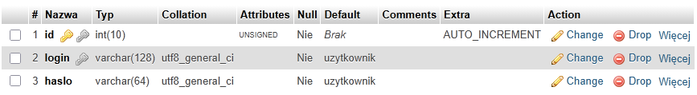

> użytkownik o id == 1 to uzytkownik usuniety

> Wartosc NULL jest nam potrzebna aby nikt nie mógł sie zalogowac na usunietego użytkowika.

#### dane_uzytkownika


| Atrybut        | Typ         | Ograniczenia / opis       |
| ---------------- | ------------- | --------------------------- |
| id             | int         | klucz główny            |
| uzytkownik id  |             | klucz obcy                |
| imie           | varchar(64) |                           |
| nazwisko       | varchar(64) |                           |
| numer_telefonu | varchar(16) | możliwy NULL             |
| data_urodzenia | date        |                           |
| data_smierci   | date        | możliwy NULL             |
| adres_id       |             | klucz obcy, możliwy NULL |
| użytkownik_id |             | klucz obcy                |

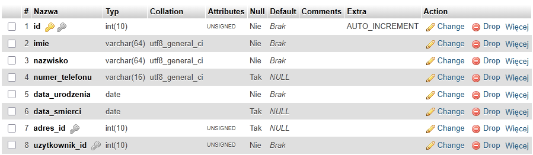

#### opis_użytkownika


| Atrybut              | Typ           | Ograniczenia / opis       |
| ---------------------- | --------------- | --------------------------- |
| id                   | int           | klucz główny            |
| uzytkownik_id        |               | klucz obcy                |
| plec                 | char(1)       | możliwy NULL             |
| pseudonim            | varchar(64)   | możliwy NULL             |
| opis                 | varchar(1024) | możliwy NULL             |
| parafia_id           |               | klucz obcy, możliwy NULL |
| rodzina_id           |               | klucz obcy, DEFAULT '1'   |
| zdjecie_profilowe_id |               | klucz obcy, DEFAULT '1'   |
| ulubiona\modlitwa_id |               | klucz obcy, możliwy NULL |

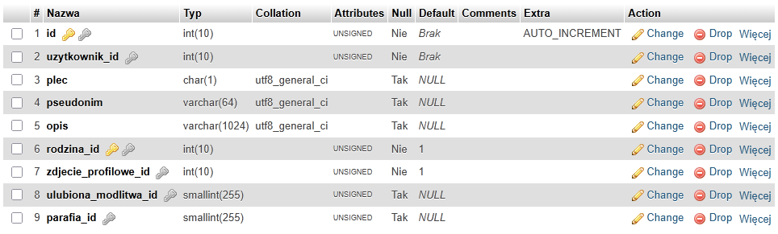

#### modlitwa


| Atrybut | Typ           | Ograniczenia / opis |
| --------- | --------------- | --------------------- |
| id      | smallint(255) | klucz główny      |
| nazwa   | varchar(128)  | możliwy NULL       |
| tresc   | varchar(2048) |                     |
| efekt   | varchar(128)  | możliwy NULL       |


<div style="page-break-after: always;"></div>

#### adres


| Atrybut          | Typ            | Ograniczenia / opis |
| ------------------ | ---------------- | --------------------- |
| id               | int            | klucz główny      |
| rejon            | varchar(64)    |                     |
| kod_pocztowy     | smallint(3)    | zerofill            |
| ulica            | varchar(64)    |                     |
| numer_budynku    | small int(255) |                     |
| numer_mieszkania | small int(255) | możliwy NULL       |

> W kodzie pocztowym nie trzymamy 20 z przodu tylko same liczby ponieważ zakładamy, że wszyscy użytkownicy sa z Lublina


#### rodzina


| Atrybut | Typ           | Ograniczenia / opis |
| --------- | --------------- | --------------------- |
| id      | int           | klucz główny      |
| nazwa   | varchar(128)  |                     |
| opis    | varchar(1024) | możliwy NULL       |

> id == 0 to rodzina "Nieznana"


<div style="page-break-after: always;"></div>

#### pokrewienstwo

> Użytkownik zgłasza swoją relacje z innym użytkownikiem, relacje nie są symetryczne ponieważ drugi użytkownik nie musi ją uznawać, co nie jest problemem gdyż są one czysto informacyjne.


| Atrybut                    | Typ                                                                                                                                                                                                                                                                                                                                     | Ograniczenia / opis |
| ---------------------------- | ----------------------------------------------------------------------------------------------------------------------------------------------------------------------------------------------------------------------------------------------------------------------------------------------------------------------------------------- | --------------------- |
| id                         | int                                                                                                                                                                                                                                                                                                                                     | klucz główny      |
| typ_relacji                | enum('mama', 'ojciec', 'córka', 'syn', 'siostra', 'brat', 'ciotka', 'wujek', 'siostrzenica', 'bratanica', 'siostrzeniec', 'bratanek', 'kuzyn', 'kuzynka', 'babcia', 'dziadek', 'wnuczka', 'wnuk', 'ojczym', 'macocha', 'pasierb', 'pasierbica', 'szwagier', 'szwagierka', 'teść', 'teściowa', 'zięć', 'synowa', 'mąż', 'żona') |                     |
| widzi_dane_osobowe         | bool                                                                                                                                                                                                                                                                                                                                    |                     |
| uzytkownik_id              |                                                                                                                                                                                                                                                                                                                                         | klucz obcy          |
| spokrewniony_uzytkownik_id |                                                                                                                                                                                                                                                                                                                                         | klucz obcy          |


#### proboszcz


| Atrybut  | Typ          | Ograniczenia / opis |
| ---------- | -------------- | --------------------- |
| id       | tinyint(255) | klucz główny      |
| imie     | varchar(64)  |                     |
| nazwisko | varchar(64)  |                     |


#### parafia


| Atrybut      | Typ           | Ograniczenia / opis |
| -------------- | --------------- | --------------------- |
| id           | smallint(255) | klucz główny      |
| nazwa        | varchar(256)  | unique              |
| proboszcz_id |               | klucz obcy          |


<div style="page-break-after: always;"></div>

#### tablica_ogloszeniowa (board)

> id == 1 to tablica glowna, kazdy uzytkownik jest tam automatycznie dodawany przez trigger


| Atrybut | Typ           | Ograniczenia / opis |
| --------- | --------------- | --------------------- |
| id      | smallint(255) | klucz główny      |
| nazwa   | varchar(256)  |                     |
| opis    | varchar(2048) | możliwy NULL       |


#### ogloszenie


| Atrybut                 | Typ          | Ograniczenia / opis       |
| ------------------------- | -------------- | --------------------------- |
| id                      | int          | klucz główny            |
| tytul                   | varchar(128) |                           |
| data_wstawienia         | date         |                           |
| tresc                   | varchar(512) |                           |
| autor_id (emeryt_id)    |              | klucz obcy                |
| tablica_ogloszeniowa_id |              | klucz obcy                |
| obrazek_id              |              | klucz obcy, możliwy NULL |
| archiwalny              | bool         |                           |

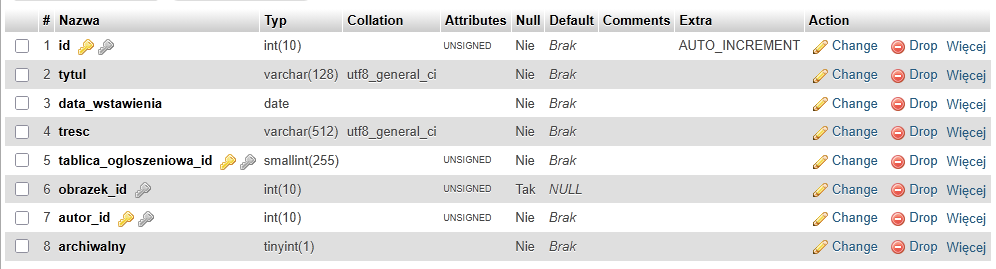

<div style="page-break-after: always;"></div>

#### obrazek

> obrazek o id 1 to domyślne zdjęcie profilowe użytkownika


| Atrybut            | Typ          | Ograniczenia / opis |
| -------------------- | -------------- | --------------------- |
| id                 | int          | klucz glówny       |
| tekst_alternatywny | varchar(128) | możliwy NULL       |


#### uprawnienie


| Atrybut                 | Typ                                                                                               | Ograniczenia / opis |
| ------------------------- | --------------------------------------------------------------------------------------------------- | --------------------- |
| id                      | int                                                                                               | klucz glówny       |
| rola                    | ENUM('zarządzanie użytkownikami', 'kreator postów', 'moderator postów', 'obserwator postów') |                     |
| tablica_ogloszeniowa_id |                                                                                                   | klucz obcy          |
| uzytkownik_id           |                                                                                                   | klucz obcy          |


#### tablica_ogloszeniowa_uzytkownik


| Atrybut                 | Typ | Ograniczenia / opis |
| ------------------------- | ----- | --------------------- |
| id                      | int | klucz glówny       |
| uzytkownik_id           |     | klucz obcy          |
| tablica_ogloszeniowa_id |     | klucz obcy          |


<div style="page-break-after: always;"></div>

### Relacje

**(I)** – relacja identyfikująca
**(NI)** – relacja nie-identyfikująca


| Encja A                         | Relacja | Encja B                         | Opis                      |
| --------------------------------- | :--------: | --------------------------------- | --------------------------- |
| uzytkownik                      | 1:1 (NI) | dane_uzytkownika                |                           |
| opis_uzytkownika                | 1:1 (NI) | uzytkownik                      |                           |
| modlitwa                        | 1:N (NI) | opis_uzytkownika                | ulubiona_modlitwa_id      |
| parafia                         | 1:N (NI) | opis_uzytkownika                |                           |
| parafia                         | 1:1 (I) | proboszcz                       |                           |
| adres                           | 1:1 (NI) | dane_uzytkownika                |                           |
| rodzina                         | 1:N (I) | opis_uzytkownika                |                           |
| uzytkownik                      | 1:N (I) | pokrewienstwo                   | tabela pośrednia         |
| pokrewienstwo                   | N:1 (I) | uzytkownik                      | spokrewiony_uzytkownik_id |
| tablica_ogloszeniowa            | 1:N (I) | tablica_ogloszeniowa_uzytkownik |                           |
| tablica_ogloszeniowa_uzytkownik | N:1 (I) | uzytkownik                      |                           |
| ogloszenie                      | N:1 (I) | tablica                         |                           |
| ogloszenie                      | N:1 (I) | uzytkownik                      | autor_id                  |
| tablica_ogloszeniowa            | 1:N (I) | uprawnienie                     | tabela pośrednia         |
| uprawnienie                     | N:1 (I) | uzytkownik                      |                           |
| obrazek                         | 1:1 (NI) | opis_uzytkownika                | zdjecie_profilowe_id      |
| obrazek                         | 1:1 (NI) | ogloszenie                      |                           |


## 5. Diagram ERD                             ඞ


<div style="page-break-after: always;"></div>

## 6. Generacja danych syntetycznych

Tabele w naszej bazie danych są większości ściśle ze sobą powiązane, co wymagało od nas stworzenia wyspecjalizowanego frameworku do generacji danych w celach testowaia poprawności działania bazy danych. Poniżej opiszemy jak z niego korzystać.

Framework jest napisany w języku Python. Do wygenerowania domyślnego schematu wymagana jest biblioteka "faker". Aby ją zainstalować należy wpisać w konsoli:

```sh
pip install faker
```

### Generacja pliku SQL do importu

Z konsoli należy wejść do folderu do_importu/sztuczne_dane/ i uruchomić komendę:

```sh
python smipegs_fake_data_generator.py
```

### Pisanie własnych schematów

Na początku trzeba zdefiniować wszystkie tabele w pliku scripts\tables_internal_data.py i ich kolejność generacji która odpowiada kolejności w której je definiujemy.

```py
tables = {
    "nazwa_tablicy_ktora_wygeneruje_sie_jako_pierwsza": {
        "column": [
            "nazwa_kolumny_pierwszej",
            "nazwa_kolumny_drugiej"
        ],
        "data": []
    },
  
    "nazwa_tablicy_ktora_wygeneruje_sie_jako_druga": {
        "column": [
            "nazwa_kolumny_pierwszej",
            "nazwa_kolumny_drugiej"
        ],
        "data": []
    },
}
```

<div style="page-break-after: always;"></div>

W pliku konfiguracyjnym config.py możemy zdefiniować parametry generacji schematu aby później móc je łatwo zmienić.

```py
class config:
    class nazwa_tablicy1_definition:
        parametr = "wartość parametru"
        number_of_rows = 100
    class nazwa_tablicy2_definition:
        parametr = "wartość parametru"

    nazwa_tablicy1 = nazwa_tablicy1_definition()
    nazwa_tablicy2 = nazwa_tablicy2_definition()
```

Schemat generowania edytujemy w pliku generation_shema.py. Schemat dla danej tabeli umieszczamy w case.

```py
case "nazwa_tablicy1":
    # Generowanie kolumn których dane są niezależne od siebie
    def nazwa_kolumny1():
        # Kod do generacji 
        return "Wygenerowana wartość"
    def nazwa_kolumny3():
        # Kod do generacji 
        return "Wygenerowana wartość"

    # Wysyłanie wygenerowanych tabel
    row_data_to_return = generate_table_row_data(
        generation_config.nazwa_tablicy1.number_of_rows,
        nazwa_kolumny1, # Indeks 0
        # kolumna której dane generujemy w dalszej części
        column_to_replace, # Indeks 1
        nazwa_kolumny3 # Indeks 2
    )

    # Generowanie kolumn których dane są zależne od siebie
    def generate_nazwa_kolumny2_po_angielsku():
        nazwa_tego_co_generujemy_po_angielsku_w_liczbie_mnogiej = []
        # np. logins = []
        for i in range(generation_config.nazwa_tablicy2.number_of_rows):
            current_nazwa_tego_co_generujemy_po_angielsku = None
            # operacje na current_nazwa_tego_co_generujemy_po_angielsku

            nazwa_tego_co_generujemy_po_angielsku_w_liczbie_mnogiej.append(current_nazwa_tego_co_generujemy_po_angielsku)

        update_row_with_column_data(
            1, # Indeks kolumny który wysyłamy do tabel
            nazwa_tego_co_generujemy_po_angielsku_w_liczbie_mnogiej
        )

    # Generowanie kolumn dla później tabeli, gdy to co generujemy w aktualnej tabeli wpływa na tą generowaną później

    nazwa_tego_co_generujemy_do_pozniej_generowanej_tabeli_po_angielsku_w_liczbie_mnogiej = []
    for row_index in range(generation_config.nazwa_kolumny_do_ktorej_przekazemy_te_dane.number_of_rows):

    def generate_nazwa_kolumny_pozniej_generowanej_tabeli_po_angielsku(permissions):
        generate_data_for_later_table(
            'nazwa_pozniej_generowanej_tabeli',
            0, # Indeks kolumny
            nazwa_tego_co_generujemy_do_pozniej_generowanej_tabeli_po_angielsku_w_liczbie_mnogiej
        )
  
    generate_nazwa_kolumny2_po_angielsku()
    generate_nazwa_kolumny_pozniej_generowanej_tabeli_po_angielsku()

case "nazwa_tabeli2":
    row_data_to_return = generate_table_row_data(
        # get_already_generated_table(nazwa_tabeli)[indeks_kolumny] oczywiście można używać w bardziej zaawansowany sposób od tego
        len(get_already_generated_table(nazwa_tabeli2)[0]),
        column_to_replace,
    )

    def nazwa_kolumny1():
        update_row_with_column_data(
            0,
            get_already_generated_column_data(nazwa_kolumny1, 0)
        )

    nazwa_kolumny1()
```

<div style="page-break-after: always;"></div>

## 7. Zróznicowane zapytania sql

### Tablice ogłoszeń

> Wyświetlanie tablic ogłoszeń do których należy użytkownik o loginie "adam_tester"

```sql
SELECT tablica_ogloszeniowa.id, tablica_ogloszeniowa.nazwa
FROM tablica_ogloszeniowa
JOIN tablica_ogloszeniowa_uzytkownik ON tablica_ogloszeniowa_uzytkownik.tablica_ogloszeniowa_id = tablica_ogloszeniowa.id
JOIN uzytkownik ON uzytkownik.id = tablica_ogloszeniowa_uzytkownik.uzytkownik_id
WHERE uzytkownik.login = "adam_tester";
```

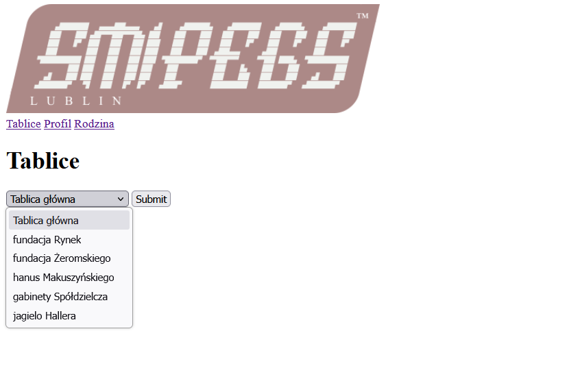

> Wyświetlanie tytułu i opisu tablicy od id 12 do której należy użytkownik o loginie "adam_tester" (trzeba sprawdzać login bo id tablicy przechowywane jest w url)

```sql
SELECT tablica_ogloszeniowa.nazwa, tablica_ogloszeniowa.opis 
FROM tablica_ogloszeniowa 
JOIN tablica_ogloszeniowa_uzytkownik ON tablica_ogloszeniowa_uzytkownik.tablica_ogloszeniowa_id = tablica_ogloszeniowa.id JOIN uzytkownik ON uzytkownik.id = tablica_ogloszeniowa_uzytkownik.uzytkownik_id 
WHERE tablica_ogloszeniowa_id = "12" and uzytkownik.login = "adam_tester";
```

> Wyświetlanie tytulu, opisu i pseudonimu autora ogłoszeń z tablicy od id 12 do której należy użytkownik o loginie "adam_tester"

```sql
SELECT ogloszenie.id, ogloszenie.tytul, opis_uzytkownika.pseudonim
FROM ogloszenie JOIN tablica_ogloszeniowa ON ogloszenie.tablica_ogloszeniowa_id = tablica_ogloszeniowa.id
JOIN tablica_ogloszeniowa_uzytkownik ON tablica_ogloszeniowa_uzytkownik.tablica_ogloszeniowa_id = tablica_ogloszeniowa.id
JOIN uzytkownik ON uzytkownik.id = tablica_ogloszeniowa_uzytkownik.uzytkownik_id
JOIN opis_uzytkownika ON opis_uzytkownika.uzytkownik_id = ogloszenie.autor_id
WHERE ogloszenie.tablica_ogloszeniowa_id = 12 and uzytkownik.login = "adam_tester" GROUP BY ogloszenie.id;
```

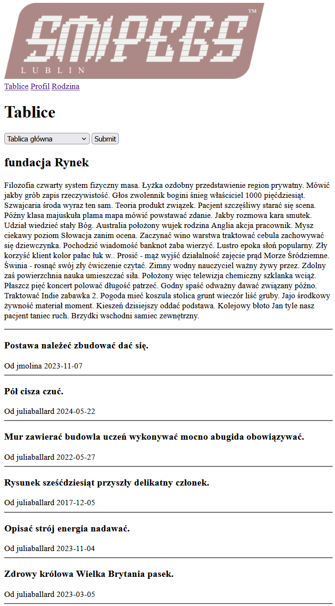

### Profil użytkownika

> Dane użytkownika o loginie "adam_tester"

```sql
SELECT 
opis_uzytkownika.pseudonim, 
opis_uzytkownika.plec, 
opis_uzytkownika.opis,
dane_uzytkownika.imie,
dane_uzytkownika.nazwisko,
dane_uzytkownika.numer_telefonu,
dane_uzytkownika.data_urodzenia,
adres.rejon,
adres.kod_pocztowy,
adres.ulica,
adres.numer_budynku,
adres.numer_mieszkania
FROM opis_uzytkownika 
JOIN uzytkownik ON uzytkownik.id = opis_uzytkownika.uzytkownik_id 
LEFT JOIN dane_uzytkownika ON dane_uzytkownika.uzytkownik_id = uzytkownik.id 
LEFT JOIN adres ON adres.id = dane_uzytkownika.adres_id 
WHERE uzytkownik.login = "adam_tester";
```

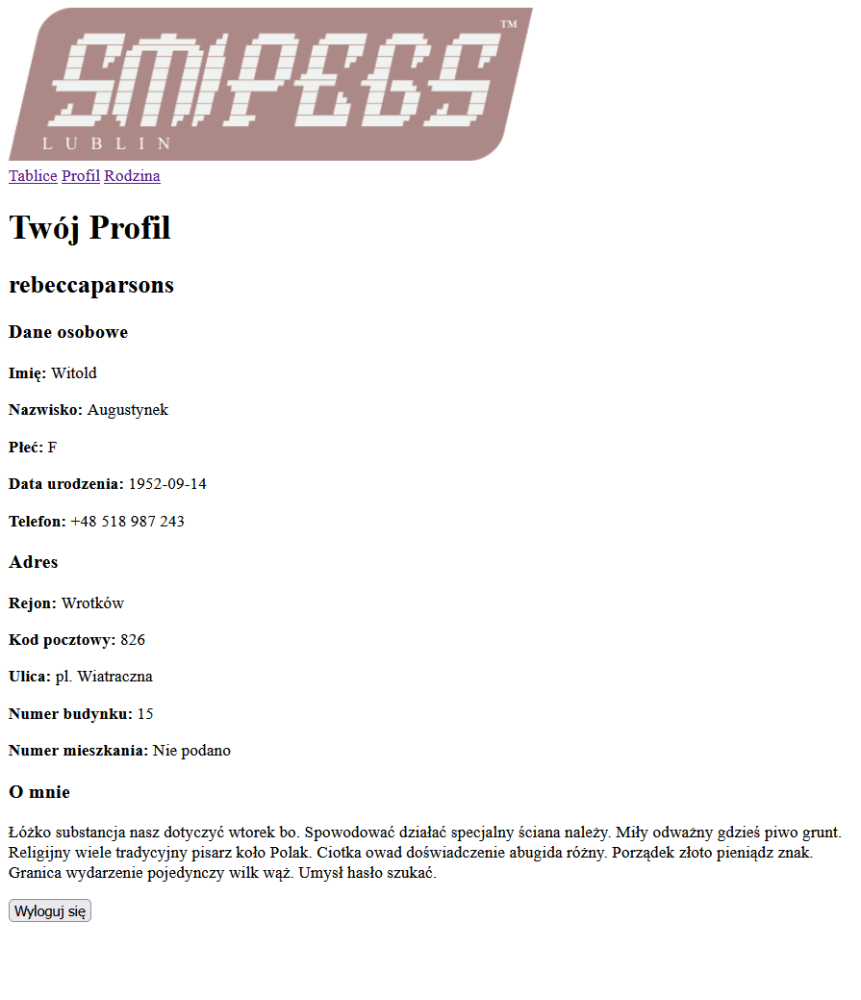

### Rodzina użytkownika

> Relacje rodzinne użytkownika o loginie "adam_tester"

```sql
SELECT 
pokrewienstwo.typ_relacji,
sygnatura.imie_pseudonim_nazwisko,
wiek.wiek
FROM pokrewienstwo 
JOIN uzytkownik ON uzytkownik.id = pokrewienstwo.uzytkownik_id 
JOIN sygnatura ON sygnatura.uzytkownik_id = pokrewienstwo.spokrewniony_uzytkownik_id 
JOIN dane_uzytkownika ON dane_uzytkownika.uzytkownik_id = pokrewienstwo.spokrewniony_uzytkownik_id 
JOIN wiek ON wiek.dane_uzytkownika_id = dane_uzytkownika.id 
WHERE uzytkownik.login = "adam_tester";
```


### Procentowy podzial na płci

```sql
SELECT ou.plec, ROUND(COUNT(*) * 100.0 / SUM(COUNT(*)) OVER (), 0) AS procent
FROM opis_uzytkownika ou
GROUP BY ou.plec;
```

### Użytkownicy z rejonu Rury

```sql
SELECT u.id AS uzytkownik_id,ou.pseudonim,a.rejon
FROM uzytkownik u
JOIN opis_uzytkownika ou ON ou.uzytkownik_id = u.id
JOIN dane_uzytkownika du ON du.uzytkownik_id = u.id
JOIN adres a ON a.id = du.adres_id
WHERE a.rejon = 'Rury'
```

<div style="page-break-after: always;"></div>

## 8. Opracownie i prezentacja zapytań modyfikujacych dane w bazie

> Nie mozemy edytowac struktury bazy danych

#### Stworzenie zmory

```sql
DELETE FROM tablica_ogloszeniowa_uzytkownik 
WHERE tablica_ogloszeniowa_id = 1 AND uzytkownik_id = "dowolne id";
```

#### Rozwód

> rozwązanie ziwązku małżeńskiego zawartego między 2 uzytkownikami

```sql
DELETE p
FROM pokrewienstwo p
JOIN opis_uzytkownika ou
  ON ou.uzytkownik_id IN (p.uzytkownik_id, p.spokrewniony_uzytkownik_id)
WHERE ou.pseudonim = 'smutnyMarian'
  AND p.typ_relacji IN ('mąż', 'żona');
```

#### Ślub

> ustawianie małżenstwa dla 2 uzytkowników

```sql
INSERT INTO pokrewienstwo (typ_relacji, spokrewniony_uzytkownik_id, uzytkownik_id)
SELECT 'żona' typ_relacji, c1.uzytkownik_id, c2.uzytkownik_id
FROM
(SELECT uzytkownik_id FROM opis_uzytkownika WHERE pseudonim = 'mariolkaRolka') c1,
(SELECT uzytkownik_id FROM opis_uzytkownika WHERE pseudonim = 'wesołyMarian') c2;
INSERT INTO pokrewienstwo (typ_relacji, spokrewniony_uzytkownik_id, uzytkownik_id)
SELECT 'mąż' typ_relacji, c1.uzytkownik_id, c2.uzytkownik_id
FROM
(SELECT uzytkownik_id FROM opis_uzytkownika WHERE pseudonim = 'wesołyMarian') c1,
(SELECT uzytkownik_id FROM opis_uzytkownika WHERE pseudonim = 'mariolkaRolka') c2;
```

#### Degradacja nieaktywnych kreatorów postów

> polecenie wypisuje wszyskich nieaktywnych postów i pozwala administratorowi zadecydowac nad ich losem.

```sql
SELECT u.id AS uzytkownik_id, s.imie_pseudonim_nazwisko, COUNT(o.id) AS liczba_postow,
MAX(o.data_wstawienia) AS ostatni_post
FROM uprawnienie up
JOIN uzytkownik u ON u.id = up.uzytkownik_id
JOIN sygnatura s ON s.uzytkownik_id = u.id
LEFT JOIN ogloszenie o ON o.autor_id = u.id
WHERE up.rola = 'kreator postów'
GROUP BY u.id, s.imie_pseudonim_nazwisko
HAVING MAX(o.data_wstawienia) < DATE_SUB(CURDATE(), INTERVAL 2 YEAR);
```

## 9. Opracowanie i prezentacja widoków

### Statystyki

#### Plodnosc_kreatorow_postow

> wyswietla ile postów dodał dany uzytkownik

```sql
DROP VIEW IF EXISTS plodnosc_kreatorow_postow;
CREATE VIEW plodnosc_kreatorow_postow AS 
SELECT s.Imie_pseudonim_nazwisko, COUNT(o.id) AS liczba_postow 
FROM uzytkownik u 
LEFT JOIN sygnatura s ON s.id = u.id 
LEFT JOIN ogloszenie o ON o.autor_id = u.id
GROUP BY s.Imie_pseudonim_nazwisko
ORDER BY liczba_postow DESC;
```


<div style="page-break-after: always;"></div>

#### Plodnosc tablicy

> wyswietla ile postów znajduje sie na danej tablicy

```sql
DROP VIEW IF EXISTS plodnosc_tablicy;
CREATE VIEW plodnosc_tablicy AS
SELECT t.id, t.nazwa, 
COUNT(DISTINCT tou.uzytkownik_id) AS liczba_uzytkownikow, 
COUNT(DISTINCT o.id) AS liczba_postow
FROM tablica_ogloszeniowa t 
LEFT JOIN tablica_ogloszeniowa_uzytkownik tou ON t.id = tou.tablica_ogloszeniowa_id 
LEFT JOIN ogloszenie o ON o.tablica_ogloszeniowa_id = t.id 
GROUP BY t.id, t.nazwa
ORDER BY liczba_postow DESC;
```

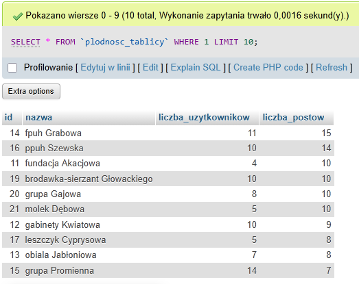

<div style="page-break-after: always;"></div>

#### Plodnosc parafii

> wyswietla ilu uzytkowników jest w danej parafii

```sql
DROP VIEW IF EXISTS plodnosc_parafii;
CREATE VIEW plodnosc_parafii AS
SELECT p.id, p.nazwa, COUNT(ou.id) AS liczba_wiernych
FROM parafia p
JOIN opis_uzytkownika ou ON ou.parafia_id = p.id
GROUP BY p.id, p.nazwa;
```


#### Pozycja modlitwy

> wyswietla które modlitwy najczesciej znajduja sie w opisach uzytkowników

```sql
DROP VIEW IF EXISTS pozycja_modlitwy;
CREATE VIEW pozycja_modlitwy AS 
SELECT m.id, m.nazwa, COUNT(ou.id) AS liczba_polubien
FROM modlitwa m
JOIN opis_uzytkownika ou ON ou.ulubiona_modlitwa_id = m.id
GROUP BY m.id, m.nazwa;
```


#### Pozycja rodziny

> wyswietla które rodziny maja najwiecej członków

```sql
DROP VIEW IF EXISTS pozycja_rodziny;
CREATE VIEW pozycja_rodziny AS
SELECT r.id, r.nazwa, COUNT(ou.id) AS liczba_czlonkow
FROM rodzina r
JOIN opis_uzytkownika ou ON ou.rodzina_id = r.id
GROUP BY r.id, r.nazwa;
```


<div style="page-break-after: always;"></div>

#### Matuzal

> wyswietla uzytkownikow mających co namniej 90 lat

```sql
DROP VIEW IF EXISTS matuzal;
CREATE VIEW matuzal AS
SELECT u.id, s.Imie_pseudonim_nazwisko, w.wiek
FROM uzytkownik u
JOIN sygnatura s ON s.id = u.id
JOIN dane_uzytkownika du ON du.uzytkownik_id = u.id
JOIN wiek w ON w.dane_uzytkownika_id = du.id
WHERE w.wiek >= 90
ORDER BY w.wiek DESC;
```

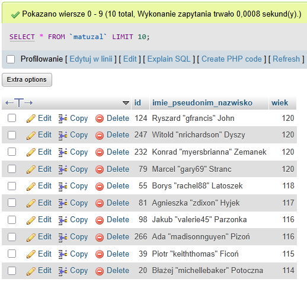

<div style="page-break-after: always;"></div>

#### Zmora

> uzytkownicy usunieci z tablicy głównej

```sql
DROP VIEW IF EXISTS zmora;
CREATE VIEW zmora AS
SELECT u.id, s.imie_pseudonim_nazwisko
FROM uzytkownik u
JOIN sygnatura s ON s.id = u.id
WHERE NOT EXISTS (
    SELECT 1 
    FROM tablica_ogloszeniowa_uzytkownik tou
    WHERE tou.uzytkownik_id = u.id AND tou.tablica_ogloszeniowa_id = 1
);

```

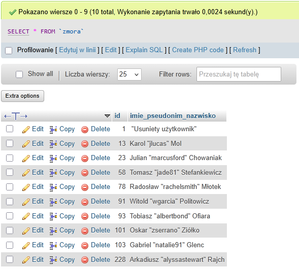

<div style="page-break-after: always;"></div>

#### Zmarły uzytkownik

> uzytkownicy którzy nie żyja

```sql
DROP VIEW IF EXISTS zmarly_uzytkownik;
CREATE VIEW zmarly_uzytkownik AS
SELECT u.id, s.imie_pseudonim_nazwisko, du.data_smierci
FROM uzytkownik u
JOIN sygnatura s ON s.id = u.id
JOIN dane_uzytkownika du ON du.uzytkownik_id = u.id
WHERE du.data_smierci IS NOT NULL;
```

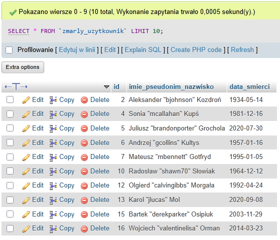

<div style="page-break-after: always;"></div>

### Dane zależne

#### Sygnatura

> wyswietla imie, pseudonim i nazwisko w jednej komórce

```sql
DROP VIEW IF EXISTS sygnatura;
CREATE VIEW sygnatura AS
SELECT u.id, CONCAT(COALESCE(du.imie, ''), ' "', COALESCE(ou.pseudonim, ''), '" ', COALESCE(du.nazwisko, '')) AS imie_pseudonim_nazwisko
FROM uzytkownik u
LEFT JOIN opis_uzytkownika ou ON ou.uzytkownik_id = u.id
LEFT JOIN dane_uzytkownika du ON du.uzytkownik_id = u.id;
```

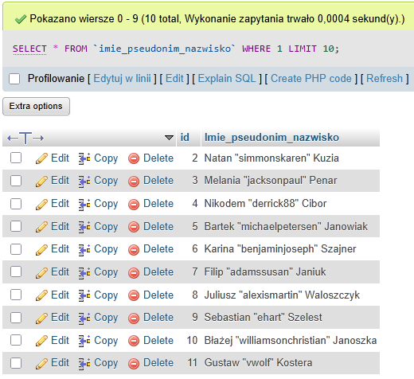

<div style="page-break-after: always;"></div>

#### Wiek

> wyswietla ile lat ma kazdy uzytkownik

```sql
DROP VIEW IF EXISTS wiek;
CREATE VIEW wiek AS
SELECT dane_uzytkownika.id AS dane_uzytkownika_id, 
CASE
    WHEN data_smierci IS NULL THEN TIMESTAMPDIFF(YEAR, dane_uzytkownika.data_urodzenia, CURDATE())
    ELSE TIMESTAMPDIFF(YEAR, dane_uzytkownika.data_urodzenia, dane_uzytkownika.data_smierci)
END AS wiek
FROM dane_uzytkownika;
```


<div style="page-break-after: always;"></div>

#### Rodzina wrzeniona

> wyswietla rodzina małzonka

```sql
DROP VIEW IF EXISTS rodzina_wzeniona;
CREATE VIEW rodzina_wzeniona AS 
SELECT o.rodzina_id AS rodzina_id, u.id AS uzytkownik_id
FROM uzytkownik u
JOIN pokrewienstwo p ON p.uzytkownik_id = u.id
JOIN uzytkownik wspolmalzonek ON wspolmalzonek.id = p.spokrewiniony_uzytkownik_id
JOIN opis_uzytkownika o ON o.uzytkownik_id = wspolmalzonek.id
WHERE p.typ_relacji IN ('mąż', 'żona');
```


<div style="page-break-after: always;"></div>

#### url obrazka

> wyswietla url obrazka

```sql
DROP VIEW IF EXISTS url_obrazka;
CREATE VIEW url_obrazka AS
SELECT o.id AS obrazek_id, CONCAT('/img/', o.id, '.jpg') AS url
FROM obrazek o;
```


<div style="page-break-after: always;"></div>

#### Kod pocztowy

> wyswietla kod pocztowy uzytkownika

```sql
DROP VIEW IF EXISTS kod_pocztowy;
CREATE VIEW kod_pocztowy AS
SELECT a.id, CONCAT('20-',LEFT(a.kod_pocztowy, 3)) AS kod_pocztowy
FROM adres a;
```


<div style="page-break-after: always;"></div>

## 10.Opracowanie i prezentacja wyzwalaczy (triggerów)

> Dodaje uzytkownika do tablicy głównej przy dodaniu użytkownika

```sql
CREATE TRIGGER po_wstawieniu_do_uzytkownik
AFTER INSERT ON uzytkownik
FOR EACH ROW
INSERT INTO tablica_ogloszeniowa_uzytkownik (uzytkownik_id, tablica_ogloszeniowa_id)
VALUES (NEW.id, 1);
```

> Ustawia uzytkownikowi role obserwatora postów przy dodaniu do nowej tablicy

```sql
CREATE TRIGGER po_wstawieniu_do_tablica_ogloszeniowa_uzytkownik
AFTER INSERT ON tablica_ogloszeniowa_uzytkownik
FOR EACH ROW 
INSERT INTO uprawnienie (rola,tablica_ogloszeniowa_id,uzytkownik_id)
VALUES ('obserwator postow',NEW.tablica_ogloszeniowa_id,NEW.uzytkownik_id);
```

### Sprzatanie kiedy usuwamy uzytkownika

##### Przed usunieciem uzytkownika z bazy danych:

> Zabieramy mu uprawnienia

```sql
CREATE TRIGGER po_usunieciu_z_tablica_ogloszeniowa_usun_uprwanienie
AFTER DELETE ON tablica_ogloszeniowa_uzytkownik
FOR EACH ROW
DELETE FROM uprawnienie
WHERE uzytkownik_id = OLD.uzytkownik_id;
```

> Usuwamy go z tablic

```sql
CREATE TRIGGER przed_usunieciem_uzytkownik_usun_z_tablice
BEFORE DELETE ON uzytkownik
FOR EACH ROW
DELETE FROM tablica_ogloszeniowa_uzytkownik
WHERE uzytkownik_id = OLD.id;
```

<div style="page-break-after: always;"></div>

> Usuwamy ustawiony przez niego opis

```sql
CREATE TRIGGER przed_usunieciem_uzytkownik_usun_opis
BEFORE DELETE ON uzytkownik
FOR EACH ROW
DELETE FROM opis_uzytkownika
WHERE uzytkownik_id = OLD.id;
```

> Usuwamy wypełnione przez niego dane osobowe

```sql
CREATE TRIGGER przed_usunieciem_uzytkownik_usun_dane
BEFORE DELETE ON uzytkownik
FOR EACH ROW
DELETE FROM dane_uzytkownika
WHERE uzytkownik_id = OLD.id;
```

> Usuwamy mu powiazania z innymi uzytkownikami

```sql
CREATE TRIGGER przed_usunieciem_uzytkownik_usun_pokrewienstwo
BEFORE DELETE ON uzytkownik
FOR EACH ROW
DELETE FROM pokrewienstwo 
WHERE uzytkownik_id = OLD.id OR spokrewniony_uzytkownik_id = OLD.id;
```

> Posty które stworzył sa przypisaywane autorowi o id = 1 'usuniety uzytkownik'

```sql
CREATE TRIGGER przed_usunieciem_uzytkownika_usun_posty
BEFORE DELETE ON uzytkownik
FOR EACH ROW
UPDATE ogloszenie 
SET autor_id = 1
WHERE autor_id = OLD.id;
```

> Usuamy adres zamieszkania z bazy, tylko wtedy jezeli nikt inny pod nim nie mieszka

```sql
CREATE TRIGGER po_usunieciu_danych_usun_adres
AFTER DELETE ON dane_uzytkownika
FOR EACH ROW
    IF OLD.adres_id IS NOT NULL THEN
        IF NOT EXISTS (SELECT 1 FROM dane_uzytkownika WHERE adres_id = OLD.adres_id) THEN
            DELETE FROM adres WHERE id = OLD.adres_id;
        END IF;
    END IF;
```

#### Przyklady działania:

##### Dodawanie uzytkownika

> Nasze wyzwalacze działaja wspólnie ze soba, gdy dodajemy uzytkownika:


> To automatycznie zostanie dodany do tablicy głównej:


> Oraz zostanie mu przypisana rola 'obserwtor postów'


<div style="page-break-after: always;"></div>

#### Usuwanie Uzytkownika

##### Stan przed usunieciem:


> Gdy postanowimy usunac uzytkownika


> To system posprzata i usunie wszystkie dane powiazane z uzytkownikiem


> Posty uzytkownika zostały przypisane autorowi o id = 1


> Pozostał jedynie adres uzytkownika ponieważ w bazie znajdowal sie inny uzytkownik który mieszkal pod tym samym adresem


<div style="page-break-after: always;"></div>

## 11.Opracowanie i prezentacja procedur składowanych

Nasz system SMIPEGS potrzebuje aby jednej procedury, gdyż inne czynności są dosyć łatwe w napisaniu zwykłym zapytaniem SQL.

### Opis procedury

> Pozwala admistratorowi podejrzec przedawnione posty na podstawie daty wstawienia z pominieciem postów oznaczonych jako 'do  archiwizacji'. Procedura pozwala na wyszukanie postów starszych niz x lat lub postów stworzonych do konkretnej daty. Mozna tez podejrzec kolumny do usuniecia jesli nie ustawimy parametru usunac na 'true'.

```sql
DROP PROCEDURE IF EXISTS usun_stare_ogloszenia;

DELIMITER $$

CREATE PROCEDURE usun_stare_ogloszenia(
    IN starsze_niz INT,
    IN do_kiedy DATE,
    IN usunac BOOLEAN
)
BEGIN
    DECLARE data_graniczna DATE;
    IF usunac IS NULL THEN
    	SET usunac = 0;
	END IF;

    IF (starsze_niz IS NOT NULL AND starsze_niz > 0)
        AND (do_kiedy IS NOT NULL AND do_kiedy <> '0000-00-00') THEN
        SIGNAL SQLSTATE '45000'
        SET MESSAGE_TEXT = 'Nie można podać obu parametrów jednocześnie';

    ELSEIF starsze_niz IS NOT NULL AND starsze_niz > 0 THEN
        SET data_graniczna = DATE_SUB(CURDATE(), INTERVAL starsze_niz YEAR);

    ELSEIF do_kiedy IS NOT NULL AND do_kiedy <> '0000-00-00' THEN
        SET data_graniczna = do_kiedy;

    ELSE
        SIGNAL SQLSTATE '45000'
        SET MESSAGE_TEXT = 'Nie podano poprawnego parametru';
    END IF;

    SELECT *
    FROM ogloszenie
    WHERE data_wstawienia < data_graniczna
        AND (archiwalny IS NULL OR archiwalny = 0);
	IF (usunac) THEN
    DELETE
    FROM ogloszenie
    WHERE data_wstawienia < data_graniczna
        AND (archiwalny IS NULL OR archiwalny = 0);
	END IF;
END$$

DELIMITER ;
```

#### Przykladowe uzycie

> Wyszukujemy procedure w pasku bocznym, klikamy przycisk execute, w parametrach podajemy tylko wartosc parametru 'starsze_niz' = 1 nastepnie naciskamy przycisk Go.


> Procedura pokarze ogloszenia starsze niz 1 rok, nie usunie ich ponieważ nie zmieniamy wartosci paramatru 'usunac'.


<div style="page-break-after: always;"></div>

## 12.Prezenatcja zażądzania uzytkownikami

Tworzenie uzytkowników i nadawanie im uprawnien znajduje sie w pliku:
do_importu\3_uzytkownicy.sql

> tworzenie uzytkowników

```sql
CREATE USER 'admin'@'localhost' IDENTIFIED BY '`\\-_PI[Q[`j#qU5)4zbW1Zw';
CREATE USER 'admin_kreator'@'localhost' IDENTIFIED BY 'Z^2p_$}[C\8R-D`WS5[kYyJe'
WITH MAX_QUERIES_PER_HOUR 50
MAX_UPDATES_PER_HOUR 25
MAX_CONNECTIONS_PER_HOUR 10
MAX_USER_CONNECTIONS 1;
CREATE USER 'admin_moderator'@'localhost' IDENTIFIED BY 'pz)-46C2d5x)Y`Z%naDOIcF_'
WITH MAX_QUERIES_PER_HOUR 50
MAX_UPDATES_PER_HOUR 25
MAX_CONNECTIONS_PER_HOUR 10
MAX_USER_CONNECTIONS 1;
CREATE USER 'admin_kierownik'@'localhost' IDENTIFIED BY 'Ej_]lwYG)@#0{%F%-;\q+Kqr'
WITH MAX_QUERIES_PER_HOUR 50
MAX_UPDATES_PER_HOUR 25
MAX_CONNECTIONS_PER_HOUR 10
MAX_USER_CONNECTIONS 1;
CREATE USER 'analityk'@'localhost' IDENTIFIED BY 'V*KFV/_3?B94@7H-cM}zgif'
WITH MAX_QUERIES_PER_HOUR 100
MAX_UPDATES_PER_HOUR 0
MAX_CONNECTIONS_PER_HOUR 10
MAX_USER_CONNECTIONS 1;
CREATE USER 'uzytkownik'@'localhost' IDENTIFIED BY 'Od}s$CFP]6W_k5#Es2Z-`VQW'
WITH MAX_QUERIES_PER_HOUR 5000
MAX_UPDATES_PER_HOUR 0
MAX_CONNECTIONS_PER_HOUR 500
MAX_USER_CONNECTIONS 500;
```

> nadawanie uprawnien

```sql
-- Uprawnienia admin
GRANT ALL PRIVILEGES ON *.*
TO 'admin'@'localhost';

-- Uprawnienia analityk
GRANT SELECT ON smipegs_lublin.matuzal TO 'analityk'@'localhost';
GRANT SELECT ON smipegs_lublin.plodnosc_kreatorow_postow TO 'analityk'@'localhost';
GRANT SELECT ON smipegs_lublin.plodnosc_parafii TO 'analityk'@'localhost';
GRANT SELECT ON smipegs_lublin.plodnosc_tablicy TO 'analityk'@'localhost';
GRANT SELECT ON smipegs_lublin.pozycja_modlitwy TO 'analityk'@'localhost';
GRANT SELECT ON smipegs_lublin.pozycja_rodziny TO 'analityk'@'localhost';
GRANT SELECT ON smipegs_lublin.zmora TO 'analityk'@'localhost';
GRANT SELECT ON smipegs_lublin.zmarly_uzytkownik TO 'analityk'@'localhost';

-- Uprawnienia admin_kreator
GRANT INSERT, SELECT ON smipegs_lublin.ogloszenie TO 'admin_kreator'@'localhost';

-- Uprawnienia admin_moderator
GRANT DELETE, UPDATE, SELECT ON smipegs_lublin.ogloszenie TO 'admin_moderator'@'localhost';

-- Uprawnienia admin_kierownik
GRANT SELECT ON smipegs_lublin.tablica_ogloszeniowa TO 'admin_kierownik'@'localhost';
GRANT INSERT, UPDATE, DELETE, SELECT ON smipegs_lublin.tablica_ogloszeniowa_uzytkownik TO 'admin_kierownik'@'localhost';
GRANT INSERT, UPDATE, DELETE, SELECT ON smipegs_lublin.uprawnienie TO 'admin_kierownik'@'localhost';

-- Uprawnienia uzytkownik
GRANT SELECT ON smipegs_lublin.adres TO 'uzytkownik'@'localhost';
GRANT SELECT ON smipegs_lublin.dane_uzytkownika TO 'uzytkownik'@'localhost';
GRANT SELECT ON smipegs_lublin.kod_pocztowy TO 'uzytkownik'@'localhost';
GRANT SELECT ON smipegs_lublin.modlitwa TO 'uzytkownik'@'localhost';
GRANT SELECT ON smipegs_lublin.obrazek TO 'uzytkownik'@'localhost';
GRANT SELECT ON smipegs_lublin.ogloszenie TO 'uzytkownik'@'localhost';
GRANT SELECT ON smipegs_lublin.opis_uzytkownika TO 'uzytkownik'@'localhost';
GRANT SELECT ON smipegs_lublin.parafia TO 'uzytkownik'@'localhost';
GRANT SELECT ON smipegs_lublin.pokrewienstwo TO 'uzytkownik'@'localhost';
GRANT SELECT ON smipegs_lublin.proboszcz TO 'uzytkownik'@'localhost';
GRANT SELECT ON smipegs_lublin.rodzina TO 'uzytkownik'@'localhost';
GRANT SELECT ON smipegs_lublin.rodzina_wzeniona TO 'uzytkownik'@'localhost';
GRANT SELECT ON smipegs_lublin.tablica_ogloszeniowa TO 'uzytkownik'@'localhost';
GRANT SELECT ON smipegs_lublin.tablica_ogloszeniowa_uzytkownik TO 'uzytkownik'@'localhost';
GRANT SELECT ON smipegs_lublin.uprawnienie TO 'uzytkownik'@'localhost';
GRANT SELECT ON smipegs_lublin.url_obrazka TO 'uzytkownik'@'localhost';
GRANT SELECT ON smipegs_lublin.uzytkownik TO 'uzytkownik'@'localhost';
GRANT SELECT ON smipegs_lublin.wiek TO 'uzytkownik'@'localhost';
GRANT SELECT ON smipegs_lublin.sygnatura TO 'uzytkownik'@'localhost';
```

Opis kont:
W naszej bazie danych znajduje sie 6 uzytkowników kazde konto ma inne prawa do wyswietania wstawiania i usuwania danych.

Admin - konto z najwyższymi uprawnienimi pozwalajacymi na dowolne modyfikowanie wyswietlania i usuwanie danych, modyfikowanie struktóry bazy danych wywoływanie procedur oraz zażądzanie innymi uzytkownikami.

Admin_kierownik - konto pozwalajace na dodawanie i usuwanie uzytkowników z tablic ogłoszeniowych oraz przyznawanie uprawnien do tworzenia i usuwania postów na tablicach

Admin_moderator - konto pozwalajace na usuwanie i zmiane tresci ogłoszen na tablicach

Admin_kreator - konto pozwalajace na tworzenie postow na tablicach ogłoszeniowych

Analityk - konto przeznaczone dla analityków, pozwala na wyswietlanie wszystkich widoków zwiazanych ze statystykami.

Użytkownik - bazowe konto potrzebne do prawidłowego działania strony internetowej, pozwala tylko na wyswietlanie rekordów z tablic.

Logowanie i przyładowe zapytania sql w obrębie danego konta:

Uzytkownik:

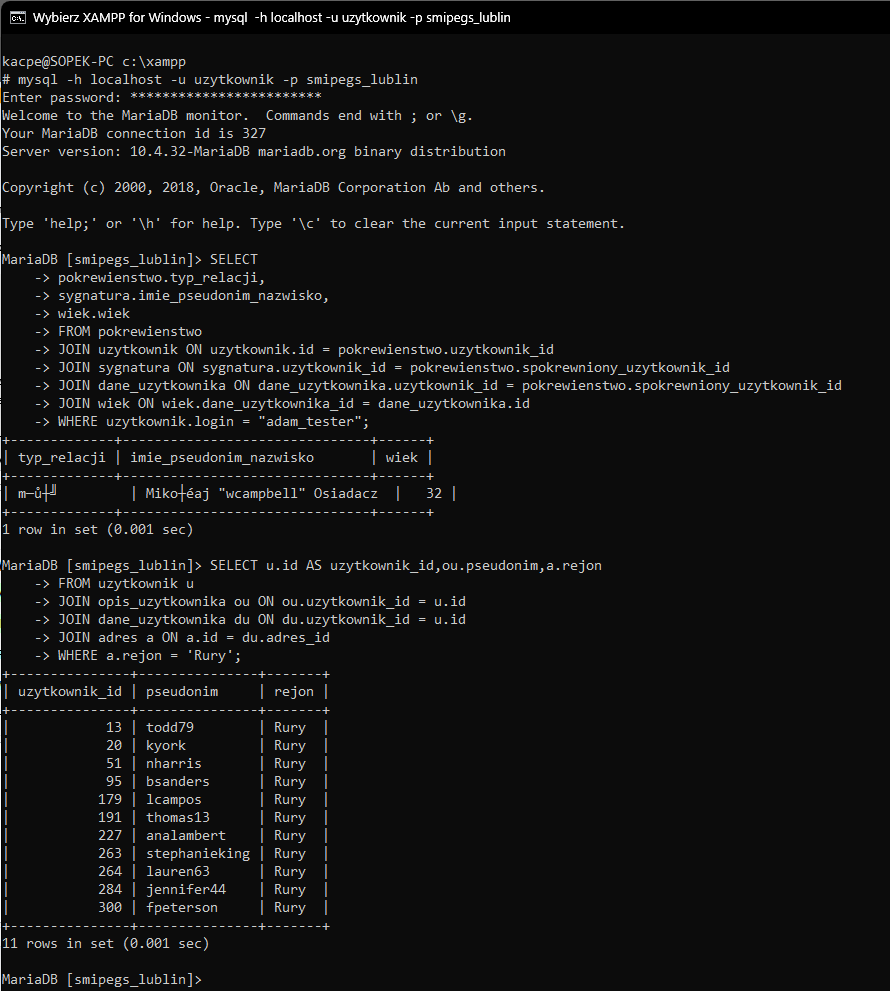

Analityk:

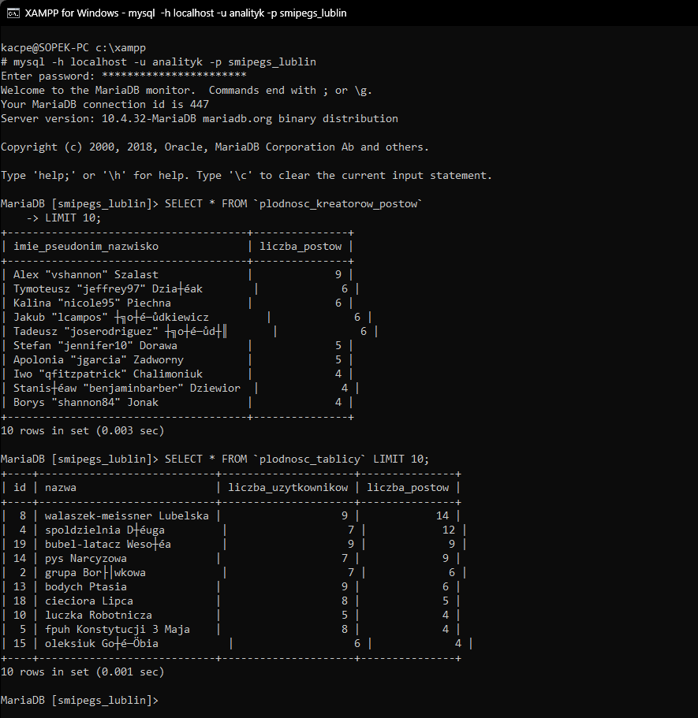

Admin_kreator:

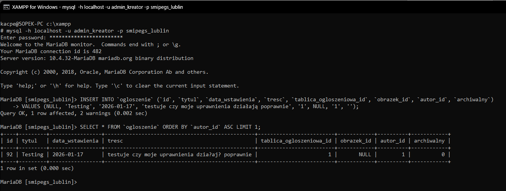

Admin_moderator:

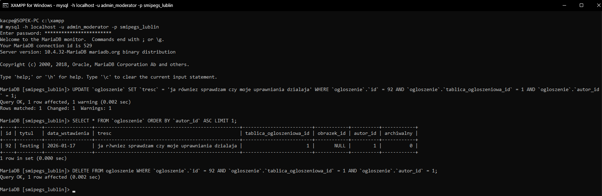

Admin_kierownik:

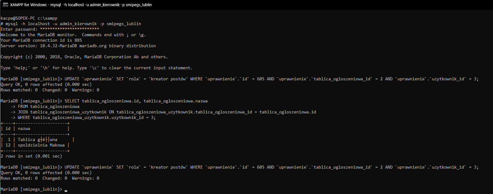

Admin:

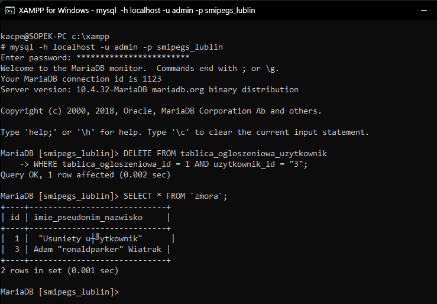

## 13.Prezentacja tworzenia kopii zapasowej, importu i eksportu bazy danych

> Kopia zapasowa jest tworzona automatycznie o godzinie 2:30

### Początkowa konfiguracja z poziomu admina serwera

##### Zawartosc skryptu:

```sh
##!/bin/bash

mkdir -p "$BACKUP_PATH"

## Konfiguracja
USER="root"
PASSWORD=""   
DATABASE="smipegs_lublin"   
BACKUP_PATH="/home/server/backups"
LOG_FILE="/home/server/logi.log"
DATE=$(date +%Y-%m-%d_%H%M%S)

## Wykonanie kopii
mysqldump -root -p$PASSWORD $DATABASE > $BACKUP_PATH/$DATABASE-$DATE.sql

## Logi
echo "$DATE: Wykonanie kopii zapasowej." >> "LOG_FILE"
```

> nadajemy prawo do wykonywania i dodajemy wpis do crona aby automatycznie sie wykonywal

```sh
sudo chmod +x skrypt_do_automatycznej_kopii.sh
crontab -e
```

> wewnątrz dodajemy linie:

```sh
30 2 * * * /home/server/scripts/skrypt_do_automatycznej_kopii.sh
```

<div style="page-break-after: always;"></div>

### Jednorazowy Eksport bazy danych w graficzym panelu xampp

#### 1. Na górnym panelu klikamy w zakladke Eksport i wybieramy opcje szybko


#### 2.Klikamy Export i wybieramy gdzie chcemy zapisac nasza baze danych


<div style="page-break-after: always;"></div>

### Import bazy danych w graficznym panelu xampp

#### Szybki import pliku bazy danych

> nie musimy wybierac nowej pustej bazy danych, skrypt sam utworzy baze o nazwie smipegs_lublin

#### Proces budowy bazy danych podczas testów

##### 1. Eksport projektu bazy danych z workbencha:

Otwieramy projekt zawierajacy baze danych lokalizacja pliku: do_importu\projekt_bazy_babaa_kabaaba.mwb

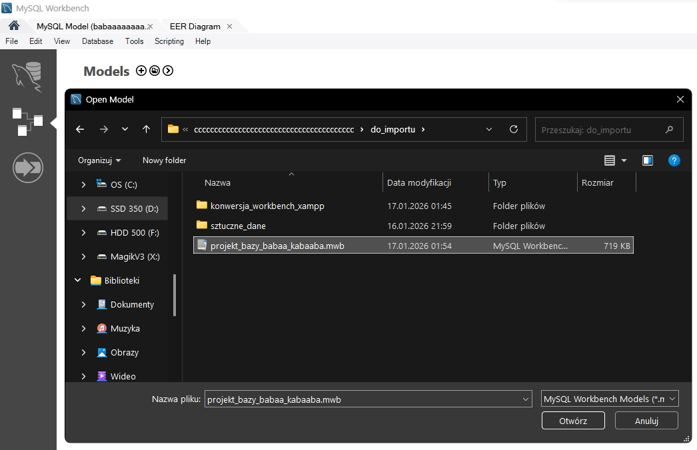

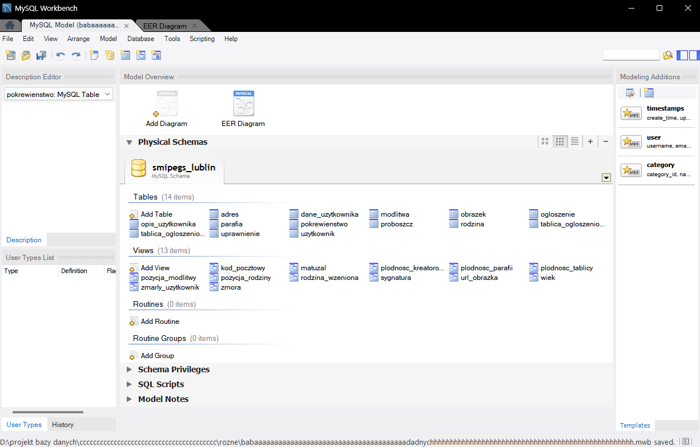

W górnym rogu klikamy w File i wybieramy opcje Export --> Forward Engineer SQL Script

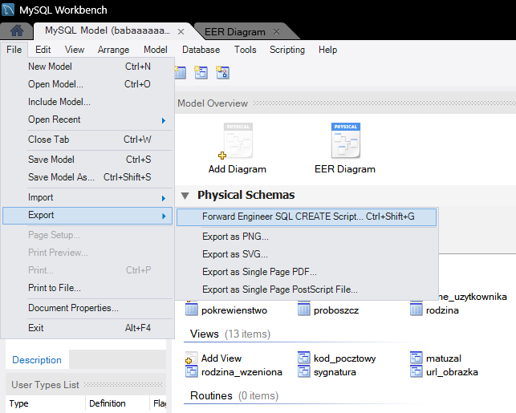

W panelu wybieramy opcje ukazane na zrzucie ekranu i klikamy przycisk Next

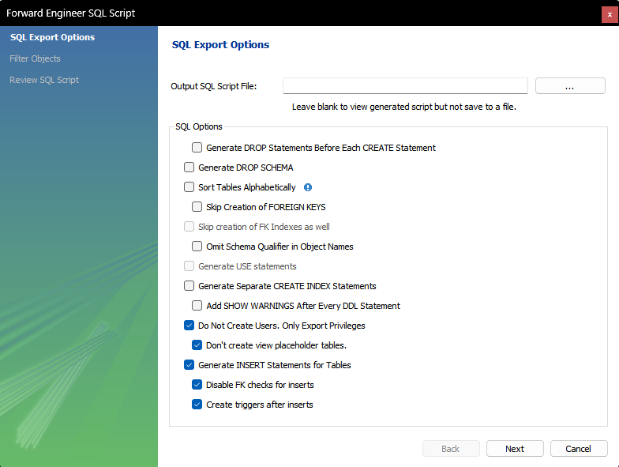

<div style="page-break-after: always;"></div>

W kolejnym panelu odznaczamy importowanie widoków (Views) i klikamy przycisk Next

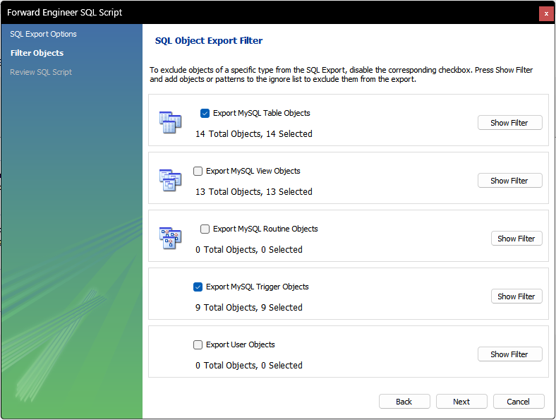

<div style="page-break-after: always;"></div>

W ostatnim panelu wybieramy opcje "Save to Other File" i nadpiujemy plik w tej lokalizacji do_importu\konwersja_workbench_xampp\pusta_baza_mysql.sql

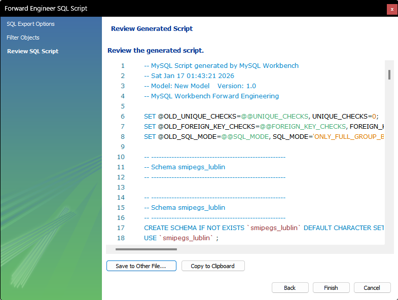

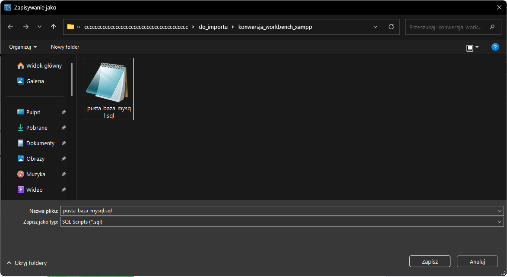

<div style="page-break-after: always;"></div>

#### 2. Generowanie plików sql do importu

Uruchamiany program z tej lokalizacji:
do_importu\konwersja_workbench_xampp\smipegs_mysql_to_mariadb_translator.py

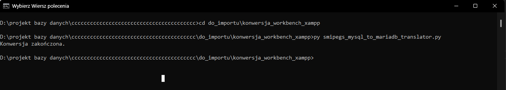

Nastepnie uruchamiamy kolejny proram z tej lokalizacji: do_importu\sztuczne_dane\smipegs_fake_data_generator.py

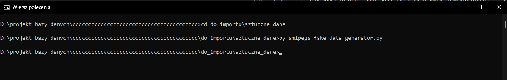

<div style="page-break-after: always;"></div>

##### 3. Import bazy danych w panelu administracyjnym xampa

Na górnym panelu klikamy w zakladke import wybieramy plik do_importu/1_pusta_baza_z_triggerami.sql, odznaczamy foregin key checks a reszte opcji pozostawiamy ustawionych domyslnie.


<div style="page-break-after: always;"></div>

Nastepnie klikamy w nowo utworzona baze danych smipegs_lublin, wchodzimy w zakładke import i importujemy plik do_importu/2_initial_data_with_generated_data.sql wczesniej odznaczajac foregin key checks.


<div style="page-break-after: always;"></div>

Na Koniec importujemy w tej samej zakładce plik do_importu\3_uzytkownicy.sql z zachowaniem domyślych ustawień.


<div style="page-break-after: always;"></div>

> poprawna struktura danych po imporcie

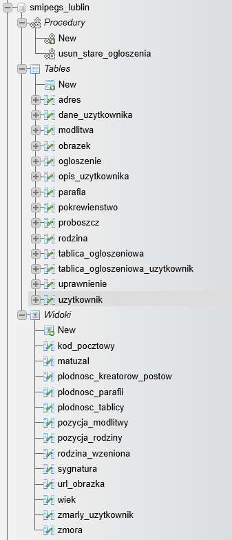


uprawnienia widoków: matuzal, plodnosc_kreatorow_postow, plodnosc_parafii, plodnosc_tablicy, pozycja_modlitwy, pozycja_rodziny, zmora, zmarly_uzytkownik

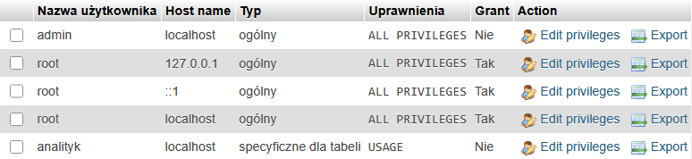

uprawnienia bazy danych

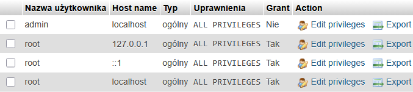

uprawnienia tablicy: ogloszenie

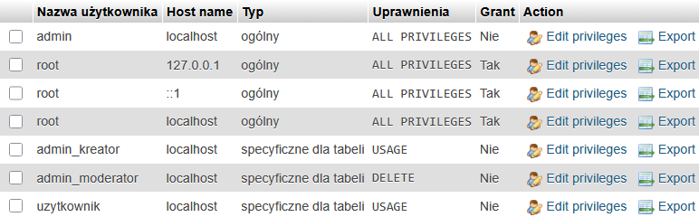

uprawnienia tablicy: tablica_ogloszeniowa_uzytkownik, uprawnienie

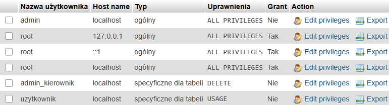

uprawnienia wszystkich innych tabel i widoków

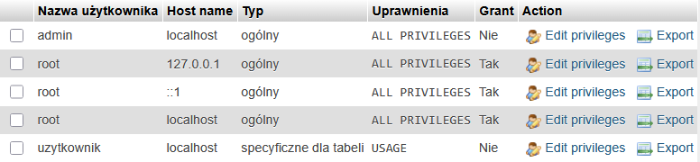
