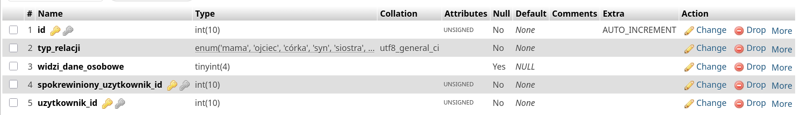
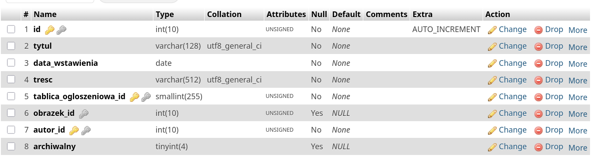
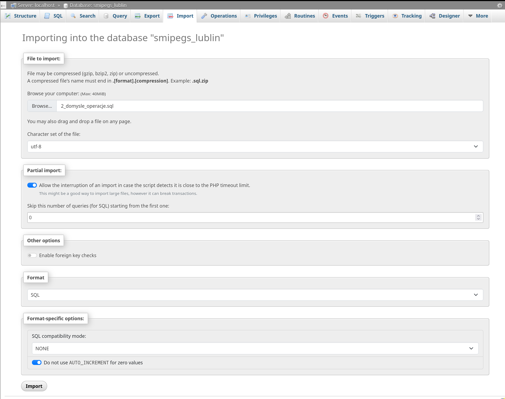
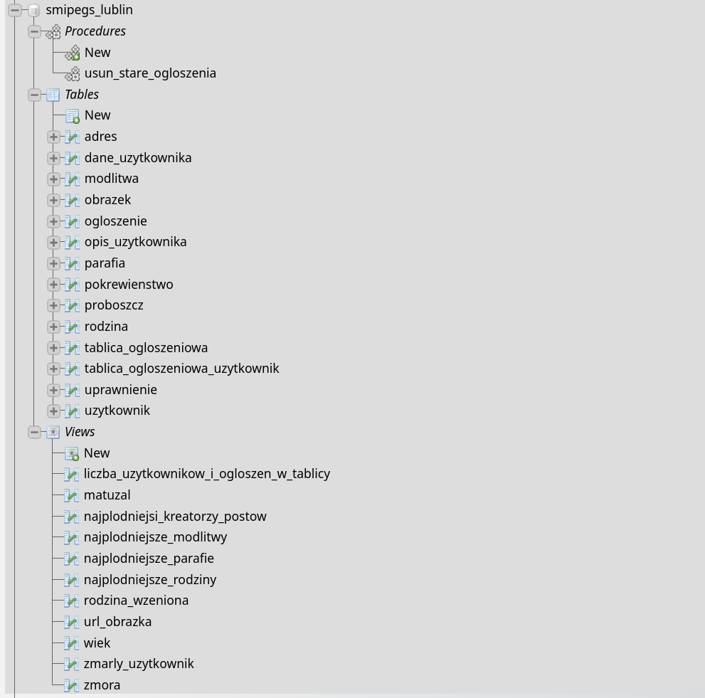

# -1. Všechno je to o penisu

Forum dla emerytów gdzie mówią co się dzieje, wydarzenia itp. znajdować się mogą po swoich zainteresowaniach, też inaczej taki słup/tablica na którą się nakleja rzeczy tylko wirtualna.

# 0. Nazwa Projektu

System Monitorowania Interakcji Pośród Emerytalnej Grupy Społecznej (SMIPEGS Lublin).

# 1. Motywacja

## Opis problematyki

Emeryci są dosyć samotni, ponieważ członkowie ich rodziny opuszczają ich, smutne. Aby radzić sobie z samotnością, wchodzą w relacje o charakterze przyjacielskim, neutralnym lub wrogim z innymi emerytami.

## Dlaczego warto to zrealizować i co ma rozwiązać

Wierzymy, iż nasz SMIPEGS Lublin pomoże w nawigacji bo tym skomplikowanym środowisku w którym każdy z nas kiedyś się znajdzie. Już dziś myślimy o naszej bliskiej przyszłości, bo sami staniemy się emerytami, memento mori.

# 2. Opis słowny

Portal społecznościowy dla emerytów wiary chrześcijańskiej, z którego również mogą korzystać użytkownicy nie podzielający tej wiary. Portal składa się z dwóch części: **Tablica** główna (o indeksie 0) i prywatne tablice na które **użytkownicy** o odpowiednich **uprawnieniach** mogą wstawiać **ogłoszenia** zawierające tekst i **obrazki**; Wyszukiwarka użytkowników w której można zobaczyć ich **opis** zawierający: ulubione **modlitwy**, **parafie** i ich **proboszcze**. Użytkownicy którzy są ze sobą w **rodzinie** mogą zobaczyć podstawowe **dane osobowe** (takie jak aktualny **adres**) osób z którymi są **spokrewnieni**.

# 3. Tabele

## Gotowe

* uzytkownik
* dane_uzytkownika
* modlitwa
* parafia
* adres
* rodzina
* pokrewienstwo
* proboszcz
* opis\_uzytkownika
* tablica\_ogloszeniowa
* ogłoszenie
* uprawnienie
* obraz
* tablica\_ogloszeniowa\_uzytkownik

# 4. Atrybuty encji i relacje

## Atrybuty encji

Jeżeli nie zostało napisane inaczej, to domyślne wartości dla każdego atrybutu to:

* unsigned (przy varcharze nie można ustawić unsigned)
* not null

Wszystkie id mają unique.

Wszystkie id są autoinkrementowane.

Boolowski typ danych jest reprezentowany przez tinyint(1).

### uzytkownik

* id				 klucz główny, int
* login			         varchar(128), unique

> blob wykracza poza nasza widze

* haslo			         varchar(64),

> używać inet6_aton(‘ipv4 lub ipv6’)
> ip wykracza poza nasza wiedze
> ip				  varbinary(16), unique


### dane_uzytkownika

* id -                             klucz główny, int
* uzytkownik id -                  klucz obcy
* imie -                           varchar(64)
* nazwisko -                       varchar(64)
* numer_telefonu                   varchar(16), możliwy NULL
* data\_urodzenia -                 date
* data\_smierci                     date, możliwy NULL
* adres\_id -                       klucz obcy, możliwy NULL
* użytkownik\_id -                  klucz obcy


### opis_użytkownika

* id				 klucz główny, int
* uzytkownik id -       klucz obcy
* plec -                char(1), możliwy NULL
* pseudonim -           varchar(64), możliwy NULL
* opis			 varchar(1024), możliwy NULL
* parafia\_id -         klucz obcy, możliwy NULL
* rodzina\_id -         klucz obcy, DEFAULT '1'
* zdjecie\_profilowe\_id	 klucz obcy, DEFAULT '1'
* ulubiona\modlitwa\_id -   klucz obcy, możliwy NULL


### modlitwa

* id -                  klucz główny, smallint(255)
* nazwa -               varchar(128), możliwy NULL
* tresc -               varchar(2048)
* efekt -               varchar(128), możliwy NULL


### adres

* id -                  klucz główny, int
* rejon -               varchar(64)

> Nie trzymamy 20 z przodu, tylko 3 cyfry

* kod\_pocztowy -       smallint(3), zerofill
* ulica -               varchar(64)
* numer\_budynku -      small int(255)
* numer\_mieszkania -   small int(255), możliwy NULL


### rodzina

> id == 0 to rodzina “Nieznana”

* id 				 klucz główny, int
* nazwa			 varchar(128)
* opis			 varchar(1024), możliwy NULL


### pokrewienstwo

> Użytkownik zgłasza swoją relacje z innym użytkownikiem, relacje nie są symetryczne ponieważ drugi użytkownik nie musi ją uznawać, co nie jest problemem gdyż są one czysto informacyjne.

* id -                  klucz główny, int
* typ\_relacji -         enum('mama', 'ojciec', 'córka', 'syn', 'siostra', 'brat', 'ciotka', 'wujek', 'siostrzenica', 'bratanica', 'siostrzeniec', 'bratanek', 'kuzyn', 'kuzynka', 'babcia', 'dziadek', 'wnuczka', 'wnuk', 'ojczym', 'macocha', 'pasierb', 'pasierbica', 'szwagier', 'szwagierka', 'teść', 'teściowa', 'zięć', 'synowa', 'mąż', 'żona'),
* widzi_dane_osobowe -	 bool
* uzytkownik\_id -           klucz obcy
* spokrewiony\_uzytkownik\_id klucz obcy



### proboszcz

* id		klucz główny, tinyint(255)
* imie			varchar(64)
* nazwisko			varchar(64)


### parafia

* id 			klucz główny, smallint(255)
* nazwa 		  	varchar(256), unique
* proboszcz_id 	  	klucz obcy


### tablica_ogloszeniowa (board)

> id == 1 to tablica glowna, kazdy uzytkownik jest tam automatycznie dodawany(trigger)
> jeżeli istnieje użytkownik o tym samym adresie ip co nowy użytkownik i ten stary użytkownik nie jest w tablicy głównej (został z niej zbanowany), to nowy użytkownik nie jest przypsiwy

* id 			klucz główny, smallint(255),
* nazwa			varchar(256)
* opis			varchar(2048), możliwy NULL


### ogloszenie

* id     			klucz główny, int
* tytul 			varchar(128)
* data_wstawienia		date
* tresc			varchar(512)
* autor_id (emeryt_id)	klucz obcy
* tablica_ogloszeniowa_id klucz obcy
* obrazek_id 		klucz obcy, możliwy NULL
* archiwalny 		bool



### obrazek

> obrazek o id 1 to domyślne zdjęcie profilowe użytkownika

* id 				klucz glówny, int
* tekst_alternatywny	varchar(128), możliwy NULL


### uprawnienie

* id				klucz glówny, int
* rola 			    enum('zarządzanie użytkownikami', 'kreator postów', 'moderator postów', 'obserwator postów')
* tablica_ogloszeniowa_id klucz obcy
* uzytkownik_id		klucz obcy


### tablica_ogloszeniowa_uzytkownik

* id				klucz glówny, int
* uzytkownik_id		klucz obcy
* tablica_ogloszeniowa_id klucz obcy


## Relacje

(I) - relacja identyfikująca.
(NI) - relacja nie-identyfikująca.

* uzytkownik	   -[1:1](NI)-	dane_uzytkownika
* opis uzytkownika  -[1:1](NI)-   uzytkownik
* modlitwa 		   -[1:N](NI)-  (ulubiona_modlitwa_id)opis użytkownika
* parafia 		   -[1:N](NI)-	opis_uzytkownika
* parafia 		   -[1:1](I)-	proboszcz
* adres 		   -[1:1](NI)-	dane_uzytkownika
* rodzina		   -[1:N](I)- opis_uztkownika
* uzytkownik 	-[1:N](I)- pokrewienstwo(tabela pośrednia) 	-[N:1](I)- spokrewiony\_uzytkownik\_id - uzytkownik
* tablica_ogloszeniowa	-[1:N](I) - tablica_ogloszeniowa_uzytkownik -[N:1](I) -	uzytkownik
* ogłoszenie		-[N:1](I)-	tablica
* ogłoszenie		-[N:1](I)-autor_id- uzytkownik
* tablica_ogloszeniowa	-[1:N](I)- uprawnienie(tabela pośrednia)	-[N:1](I)- uzytkownik
* obrazek		-zdjecie\_profilowe\_id-[1:1](NI)-	opis uzytkownika
* obrazek			-[1:1](NI)-	ogloszenie

# 5. Diagram ERD 					    ඞ


# 7. Zróznicowane zapytania sql

> Wyświetlanie tablicy głownej

```sql
SELECT * FROM `ogloszenie` WHERE tablica_ogloszeniowa_id = 1;
```

Profil główny użytkownika

Profil rodzinny użytkowanika
> Procentowy podzial na płci
```sql
SELECT ou.plec, ROUND(COUNT(*) * 100.0 / SUM(COUNT(*)) OVER (), 0) AS procent
FROM opis_uzytkownika ou
GROUP BY ou.plec;
```

> Ludzie z twojej okolicy
```sql
SELECT u.id AS uzytkownik_id,ou.pseudonim,a.rejon
FROM uzytkownik u
JOIN opis_uzytkownika ou ON ou.uzytkownik_id = u.id
JOIN dane_uzytkownika du ON du.uzytkownik_id = u.id
JOIN adres a ON a.id = du.adres_id
WHERE a.rejon = 'Rury'
```

# 8. Opracownie i prezentacja zapytan modyfikujacych dane w bazie

> Nie mozemy edytowac struktury bazy danych
> reczne stworzenie zmory

> degradacja nieaktywnych kreatorów postów

```sql
SELECT 
u.id AS uzytkownik_id,
ou.pseudonim,
pk.liczba_postow AS liczba_postow
FROM uprawnienie up
JOIN uzytkownik u ON u.id = up.uzytkownik_id
JOIN opis_uzytkownika ou ON ou.uzytkownik_id = u.id
JOIN plodnosc_kreatorow_postow pk ON pk.pseudonim = ou.pseudonim
WHERE up.rola = 'kreator postów'
AND NOT EXISTS (
SELECT 1
FROM ogloszenie o
WHERE o.autor_id = u.id
AND o.data_wstawienia >= DATE_SUB(CURDATE(), INTERVAL 2 YEAR)
);
```

#

# 9. Opracowanie i prezentacja widoków

## (Statystyki)

### Plodnosc_kreatorow_postow

> wyswietla ile postów dodał dany uzytkownik

```sql
DROP VIEW IF EXISTS plodnosc_kreatorow_postow;
CREATE VIEW plodnosc_kreatorow_postow AS 
SELECT ou.pseudonim, COUNT(o.id) AS liczba_postow 
FROM uzytkownik u 
LEFT JOIN opis_uzytkownika ou ON ou.uzytkownik_id = u.id 
LEFT JOIN ogloszenie o ON o.autor_id = u.id
GROUP BY ou.pseudonim
ORDER BY liczba_postow DESC;
```

### Plodnosc tablicy

> wyswietla ile postów znajduje sie na danej tablicy

```sql
DROP VIEW IF EXISTS plodnosc_tablicy;
CREATE VIEW plodnosc_tablicy AS
SELECT t.id, t.nazwa, 
COUNT(DISTINCT tou.uzytkownik_id) AS liczba_uzytkownikow, 
COUNT(DISTINCT o.id) AS liczba_postow
FROM tablica_ogloszeniowa t 
LEFT JOIN tablica_ogloszeniowa_uzytkownik tou ON t.id = tou.tablica_ogloszeniowa_id 
LEFT JOIN ogloszenie o ON o.tablica_ogloszeniowa_id = t.id 
GROUP BY t.id, t.nazwa
ORDER BY liczba_uzytkownikow DESC;
```

### Plodnosc parafii

> wyswietla ilu uzytkowników jest w danej parafii

```sql
DROP VIEW IF EXISTS plodnosc_parafii;
CREATE VIEW plodnosc_parafii AS
SELECT p.id, p.nazwa, COUNT(ou.id) AS liczba_wiernych
FROM parafia p
JOIN opis_uzytkownika ou ON ou.parafia_id = p.id
GROUP BY p.id, p.nazwa;
```

### Pozycja modlitwy

> wyswietla które modlitwy najczesciej znajduja sie w opisach uzytkowników

```sql
DROP VIEW IF EXISTS pozycja_modlitwy;
CREATE VIEW pozycja_modlitwy AS 
SELECT m.id, m.nazwa, COUNT(ou.id) AS liczba_polubien
FROM modlitwa m
JOIN opis_uzytkownika ou ON ou.ulubiona_modlitwa_id = m.id
GROUP BY m.id, m.nazwa;
```

### Pozycja rodziny

> wyswietla które rodziny maja najwiecej członków

```sql
DROP VIEW IF EXISTS pozycja_rodziny;
CREATE VIEW pozycja_rodziny AS
SELECT r.id, r.nazwa, COUNT(ou.id) AS liczba_czlonkow
FROM rodzina r
JOIN opis_uzytkownika ou ON ou.rodzina_id = r.id
GROUP BY r.id, r.nazwa;
```

### Matuzal

> wyswietla uzytkownikow majacych co namniej 90 lat

```sql
DROP VIEW IF EXISTS matuzal;
CREATE VIEW matuzal AS
SELECT u.id, ou.pseudonim, w.wiek
FROM uzytkownik u
JOIN opis_uzytkownika ou ON ou.uzytkownik_id = u.id
JOIN dane_uzytkownika du ON du.uzytkownik_id = u.id
JOIN wiek w ON w.dane_uzytkownika_id = du.id
WHERE w.wiek >= 90
ORDER BY w.wiek DESC;
```

### Zmora

> uzytkownicy usunieci z tablicy głównej

```sql
DROP VIEW IF EXISTS zmora;
CREATE VIEW zmora AS
SELECT u.id, ou.pseudonim
FROM uzytkownik u
JOIN opis_uzytkownika ou ON ou.uzytkownik_id = u.id
WHERE NOT EXISTS (
    SELECT 1 
    FROM tablica_ogloszeniowa_uzytkownik tou
    WHERE tou.uzytkownik_id = u.id AND tou.tablica_ogloszeniowa_id = 1
);
```

### Zmarli urzytkownicy

> uzytkownicy którzy nie żyja

```sql
DROP VIEW IF EXISTS zmarly_uzytkownik;
CREATE VIEW zmarly_uzytkownik AS
SELECT u.id, ou.pseudonim, du.data_smierci
FROM uzytkownik u
JOIN opis_uzytkownika ou ON ou.uzytkownik_id = u.id
JOIN dane_uzytkownika du ON du.uzytkownik_id = u.id
WHERE du.data_smierci IS NOT NULL;
```

## — koniec statystyk —

### Wieki uzytkowników

> wyswietla ile lat ma kazdy uzytkownik

```sql
DROP VIEW IF EXISTS wiek;
CREATE VIEW wiek AS
SELECT dane_uzytkownika.id AS dane_uzytkownika_id, 
CASE
    WHEN data_smierci IS NULL THEN TIMESTAMPDIFF(YEAR, dane_uzytkownika.data_urodzenia, CURDATE())
    ELSE TIMESTAMPDIFF(YEAR, dane_uzytkownika.data_urodzenia, dane_uzytkownika.data_smierci)
END AS wiek
FROM dane_uzytkownika;
```

### Rodzina wrzeniona

> wyswietla rodzina małzonka

```sql
DROP VIEW IF EXISTS rodzina_wzeniona;
CREATE VIEW rodzina_wzeniona AS 
SELECT o.rodzina_id AS rodzina_id, u.id AS uzytkownik_id
FROM uzytkownik u
JOIN pokrewienstwo p ON p.uzytkownik_id = u.id
JOIN uzytkownik wspolmalzonek ON wspolmalzonek.id = p.spokrewiniony_uzytkownik_id
JOIN opis_uzytkownika o ON o.uzytkownik_id = wspolmalzonek.id
WHERE p.typ_relacji IN ('mąż', 'żona');
```

### url obrazka

> wyswietla url obrazka

```sql
DROP VIEW IF EXISTS url_obrazka;
CREATE VIEW url_obrazka AS
SELECT o.id AS obrazek_id, CONCAT('/img/', o.id, '.jpg') AS url
FROM obrazek o;
```

# 10.Opracowanie i prezentacja wyzwalaczy (triggerów)

Nadanie uprawnień obserwatora przy dodaniu do tablicy
Dodanie użytkownika do tablicy głównej przy dodaniu użytkownika

# 11.Opracowanie i prezentacja procedur składowanych

Archiwizacja

# 13.Prezentacja tworzenia kopii zapasowej, importu i eksportu bazy danych

Kopia zapasowa jest tworzona automatycznie o godzinie 2:30

## Początkowa konfiguracja z poziomu admina serwera

Zawartosc skryptu:

```sh
#!/bin/bash

# Konfiguracja
USER="root"
PASSWORD=""   
DATABASE="smipegs"   
BACKUP_PATH="/home/server/backups"
DATE=$(date +%Y-%m-%d_%H%M%S)

# Wykonanie kopii z kompresją (oszczędność miejsca)
mysqldump -root -p$PASSWORD $DATABASE > $BACKUP_PATH/$DATABASE-$DATE.sql

# Logi
echo "$DATE: Wykonanie kopii zapasowej." >> logi.txt
```

```sh
sudo chmod +x skrypt_do_automatycznej_kopii.sh
chrontab -e
```

wewnątrz dodajemy linie:

```sh
30 2 * * * skrypt_do_automatycznej_kopii.sh
```

# Jednorazowy Eksport bazy danych w graficzym panelu xampp

## 1. Na górnym panelu klikamy w zakladke Eksport i wybieramy opcje szybko


## 2.Klikamy Export i wybieramy gdzie chcemy zapisac nasza baze danych


## Import bazy danych w graficznym panelu xampp

> nie musimy wybierac nowej pustej bazy danych, skrypt sam utworzy baze o nazwie smipegs_lublin

## 1. Na górnym panelu klikamy w zakladke import wybieramy plik do_importu/1_pusta_baza_z_triggerami.sql, odznaczamy foregin key checks a reszte opcji pozostawiamy ustawionych domyslnie.


## 2. Nastepnie klikamy w nowo utworzona baze danych smipegs_lublin, wchodzimy w zakładke import i importujemy plik do_importu/2_widoki.sql wczesniej odznaczajac foregin key checks.



## 3. Na koniec do bazy smipegs lublin importujemy plik do_importu/3_generated_data.sql odznaczajac foregin key cheks.


> poprawna struktura danych po imporcie


