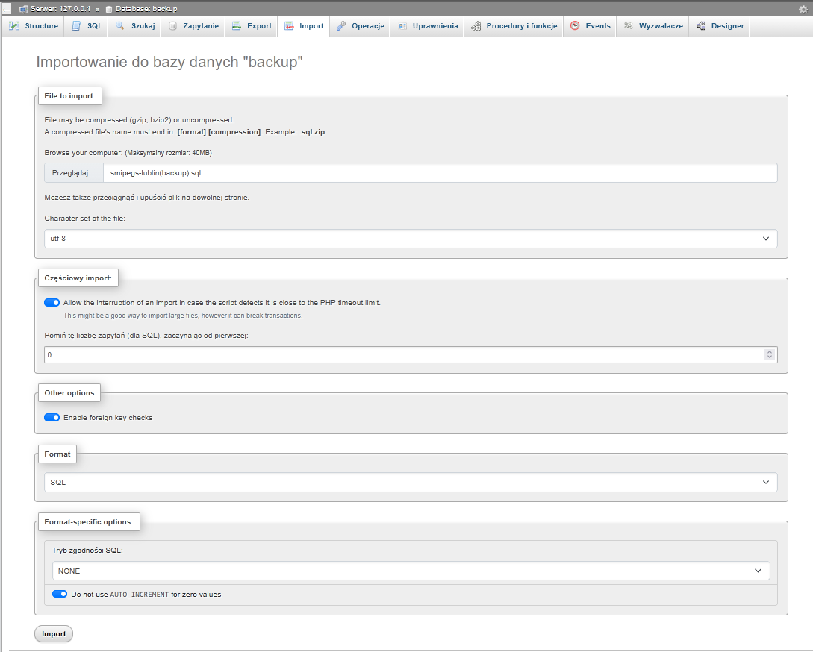
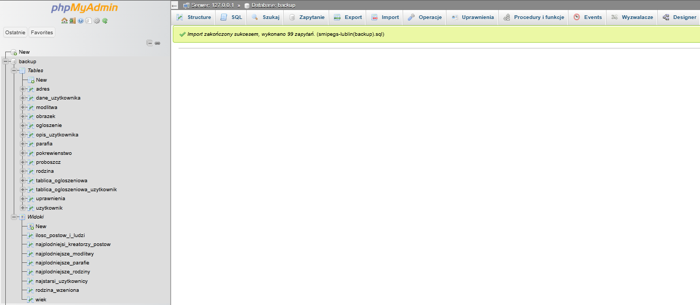

# -1. Všechno je to o penisu

Forum dla emerytów gdzie mówią co się dzieje, wydarzenia itp. znajdować się mogą po swoich zainteresowaniach, też inaczej taki słup/tablica na którą się nakleja rzeczy tylko wirtualna.

# 0. Nazwa Projektu

System Monitorowania Interakcji Pośród Emerytalnej Grupy Społecznej (SMIPEGS Lublin).

# 1. Motywacja

## Opis problematyki

Emeryci są dosyć samotni, ponieważ członkowie ich rodziny opuszczają ich, smutne. Aby radzić sobie z samotnością, wchodzą w relacje o charakterze przyjacielskim, neutralnym lub wrogim z innymi emerytami.

## Dlaczego warto to zrealizować i co ma rozwiązać

Wierzymy, iż nasz SMIPEGS Lublin pomoże w nawigacji bo tym skomplikowanym środowisku w którym każdy z nas kiedyś się znajdzie. Już dziś myślimy o naszej bliskiej przyszłości, bo sami staniemy się emerytami, memento mori.

# 2. Opis słowny

Portal społecznościowy dla emerytów wiary chrześcijańskiej, z którego również mogą korzystać użytkownicy nie podzielający tej wiary. Portal składa się z dwóch części: **Tablica** główna (o indeksie 0) i prywatne tablice na które **użytkownicy** o odpowiednich **uprawnieniach** mogą wstawiać **ogłoszenia** zawierające tekst i **obrazki**; Wyszukiwarka użytkowników w której można zobaczyć ich **opis** zawierający: ulubione **modlitwy**, **parafie** i ich **proboszcze**. Użytkownicy którzy są ze sobą w **rodzinie** mogą zobaczyć podstawowe **dane osobowe** (takie jak aktualny **adres**) osób z którymi są **spokrewnieni**.

# 3. Tabele

## Gotowe

* uzytkownik
* dane_uzytkownika
* modlitwa
* parafia
* adres
* rodzina
* pokrewienstwo
* proboszcz
* opis\_uzytkownika
* tablica\_ogloszeniowa
* ogłoszenie
* uprawnienie
* obraz
* tablica\_ogloszeniowa\_uzytkownik

# 4. Atrybuty encji i relacje

## Atrybuty encji

Jeżeli nie zostało napisane inaczej, to domyślne wartości dla każdego atrybutu to:

* unsigned (przy varcharze nie można ustawić unsigned)
* not null

Wszystkie id mają unique.

Wszystkie id są autoinkrementowane.

Boolowski typ danych jest reprezentowany przez tinyint(1).

### uzytkownik

* id				 klucz główny, int
* login			 varchar(128), unique
> blob wykracza poza nasza widze
* haslo			 varchar(64),
> używać inet6_aton(‘ipv4 lub ipv6’)
> ip wykracza poza nasza wiedze
> ip				 varbinary(16), unique

### dane_uzytkownika

* id -                  klucz główny, int
* uzytkownik id -       klucz obcy
* imie -                varchar(64)
* nazwisko -            varchar(64)
* numer_telefonu        varchar(16), możliwy NULL
* data\_urodzenia -     date
* data\_smierci         date, możliwy NULL
* adres\_id -           klucz obcy, możliwy NULL
* użytkownik\_id -      klucz obcy

### opis_użytkownika

* id				 klucz główny, int
* uzytkownik id -       klucz obcy
* plec -                char(1), możliwy NULL
* pseudonim -           varchar(64), możliwy NULL
* opis			 varchar(1024), możliwy NULL
* parafia\_id -         klucz obcy, możliwy NULL
* rodzina\_id -         klucz obcy, DEFAULT '1'
* zdjecie\_profilowe	 klucz obcy, DEFAULT '1'
* ulubiona\modlitwa\_id -   klucz obcy, możliwy NULL

### modlitwa

* id -                  klucz główny, smallint(255)
* nazwa -               varchar(128), możliwy NULL
* tresc -               varchar(2048)
* efekt -               varchar(128), możliwy NULL

### adres

* id -                  klucz główny, int
* rejon -               varchar(64)
> Nie trzymamy 20 z przodu, tylko 3 cyfry
* kod\_pocztowy -       smallint(3), zerofill
* ulica -               varchar(64)
* numer\_budynku -      small int(255)
* numer\_mieszkania -   small int(255), możliwy NULL

### rodzina

> id == 0 to rodzina “Nieznana”

* id 				 klucz główny, int
* nazwa			 varchar(128)
* opis			 varchar(1024), możliwy NULL

### pokrewienstwo

> Użytkownik zgłasza swoją relacje z innym użytkownikiem, relacje nie są symetryczne ponieważ drugi użytkownik nie musi ją uznawać, co nie jest problemem gdyż są one czysto informacyjne.

* id -                  klucz główny, int
* typ\_relacji -         enum('mama', 'ojciec', 'córka', 'syn', 'siostra', 'brat', 'ciotka', 'wujek', 'siostrzenica', 'bratanica', 'siostrzeniec', 'bratanek', 'kuzyn', 'kuzynka', 'babcia', 'dziadek', 'wnuczka', 'wnuk', 'ojczym', 'macocha', 'pasierb', 'pasierbica', 'szwagier', 'szwagierka', 'teść', 'teściowa', 'zięć', 'synowa', 'mąż', 'żona'),
* widzi_dane_osobowe -	 bool
* uzytkownik\_id -           klucz obcy
* spokrewiony\_uzytkownik\_id klucz obcy

### proboszcz

* id				klucz główny, tinyint(255)
* imie			varchar(64)
* nazwisko			varchar(64)

### parafia

* id 			  	klucz główny, smallint(255)
* nazwa 		  	varchar(256), unique
* proboszcz_id 	  	klucz obcy

### tablica_ogloszeniowa (board)

> id == 1 to tablica glowna, kazdy uzytkownik jest tam automatycznie dodawany(trigger)
> jeżeli istnieje użytkownik o tym samym adresie ip co nowy użytkownik i ten stary użytkownik nie jest w tablicy głównej (został z niej zbanowany), to nowy użytkownik nie jest przypsiwy

* id 				klucz główny, smallint(255),
* nazwa			varchar(256)
* opis			varchar(2048), możliwy NULL

### ogloszenie

* id     			klucz główny, int
* tytul 			varchar(128)
* data_wstawienia		date
* tresc			varchar(512)
* autor_id (emeryt_id)	klucz obcy
* tablica_ogloszeniowa_id klucz obcy
* obrazek_id 		klucz obcy, możliwy NULL
* archiwalny 		bool

### obrazek

> obrazek o id 1 to domyślne zdjęcie profilowe użytkownika

* id 				klucz glówny, int
* tekst_alternatywny	varchar(128), możliwy NULL

### uprawnienie

* id				klucz glówny, int
* rola 			enum('zarządzanie postami i użytkownikami', 'kreator postów', 'moderator postów', 'obserwator postów')
* tablica_ogloszeniowa_id klucz obcy
* uzytkownik_id		klucz obcy

### tablica_ogloszeniowa_uzytkownik

* id				klucz glówny, int
* uzytkownik_id		klucz obcy
* tablica_ogloszeniowa_id klucz obcy

## Relacje

(I) - relacja identyfikująca.
(NI) - relacja nie-identyfikująca.

* uzytkownik	   -[1:1](NI)-	dane_uzytkownika
* opis uzytkownika  -[1:1](NI)-   uzytkownik
* modlitwa 		   -[1:N](NI)-  (ulubiona_modlitwa_id)opis użytkownika
* parafia 		   -[1:N](NI)-	opis_uzytkownika
* parafia 		   -[1:1](I)-	proboszcz
* adres 		   -[1:1](NI)-	dane_uzytkownika
* rodzina		   -[1:N](I)- opis_uztkownika
* uzytkownik 	-[1:N](I)- pokrewienstwo(tabela pośrednia) 	-[N:1](I)- spokrewiony\_uzytkownik\_id - uzytkownik
* tablica_ogloszeniowa	-[1:N](I) - tablica_ogloszeniowa_uzytkownik -[N:1](I) -	uzytkownik
* ogłoszenie		-[N:1](I)-	tablica
* ogłoszenie		-[N:1](I)-autor_id- uzytkownik
* tablica_ogloszeniowa	-[1:N](I)- uprawnienie(tabela pośrednia)	-[N:1](I)- uzytkownik
* obrazek		-zdjecie\_profilowe\_id-[1:1](NI)-	opis uzytkownika
* obrazek			-[1:1](NI)-	ogloszenie

# 5. Diagram ERD 					    ඞ


# 7. Zróznicowane zapytania sql

Wyświetlanie tablicy głownej
Profil główny użytkownika
Profil rodzinny użytkowanika

# 8. Opracownie i prezentacja zapytan modyfikujacych dane w bazie
> Nie mozemy edytowac struktury bazy danych


# 9. Opracowanie i prezentacja widoków

(Statystyki)
Najpłodniejsi kreatorzy postów
Najpłodniejsze tablice
Najpłodniejsze parafie
Najpłodniejsze modliwy
Najpłodniejsza rodzina
Matuzal(najstarsi ludzie)
Zbanowani użytkownicy
— koniec statystyk —
Zmarli urzytkownicy
Wieki
Rodzina wrzeniona
adres_URL(/img/{id}.jpg)

10.Opracowanie i prezentacja wyzwalaczy (triggerów)

Nadanie uprawnień obserwatora przy dodaniu do tablicy
Dodanie użytkownika do tablicy głównej przy dodaniu użytkownika
dodanie domyślnego avatara / sprawdzenie czy nie jest pusty
dodanie do rodziny domyslej wartosci 1 - “rodzina nieznana”

# 11.Opracowanie i prezentacja procedur składowanych

Archiwizacja

# 13.Prezentacja tworzenia kopii zapasowej, importu i eksportu bazy danych

Kopia zapasowa jest tworzona automatycznie o godzinie 2:30

## Początkowa konfiguracja z poziomu admina serwera

Zawartosc skryptu:

```sh
#!/bin/bash

# Konfiguracja
USER="root"
PASSWORD=""   
DATABASE="smipegs"   
BACKUP_PATH="/home/server/backups"
DATE=$(date +%Y-%m-%d_%H%M%S)

# Wykonanie kopii z kompresją (oszczędność miejsca)
mysqldump -root -p$PASSWORD $DATABASE > $BACKUP_PATH/$DATABASE-$DATE.sql

# Logi
echo "$DATE: Wykonanie kopii zapasowej." >> logi.txt
```

```sh
sudo chmod +x skrypt_do_automatycznej_kopii.sh
chrontab -e
```

wewnątrz dodajemy linie:

```sh
30 2 * * * skrypt_do_automatycznej_kopii.sh
```

# Jednorazowy Eksport bazy danych w graficzym panelu xampp

## 1. Na górnym panelu klikamy w zakladke Eksport i wybieramy opcje szybko


## 2.Klikamy Export i wybieramy gdzie chcemy zapisac nasza baze danych


# Import bazy danych w graficznym panelu xampp

# 1. Wybieramy z listy pusta baze danych do której chcemy zaimportowac dane

# 2. Na górnym panelu klikamy w zakladke import wybieramy plik z którego chcemy importować, reszte opcji pozostawiamy ustawionych domyslnie.



# 3. Klikamy Import



