# -1. Załorzenia projektu cos? jesze?

Zakładamy ze nasza baza danych stoi na serwerze dzialajacym na Linuxie, aby nasz skrypt tworzenia kopii zapasowej działał.

# 0. Nazwa Projektu

System Monitorowania Interakcji Pośród Emerytalnej Grupy Społecznej (SMIPEGS Lublin).

# 1. Motywacja

## Opis problematyki

Emeryci są dosyć samotni, ponieważ członkowie ich rodziny opuszczają ich, smutne. Aby radzić sobie z samotnością, wchodzą w relacje o charakterze przyjacielskim, neutralnym lub wrogim z innymi emerytami.

## Dlaczego warto to zrealizować i co ma rozwiązać

Wierzymy, iż nasz SMIPEGS Lublin pomoże w nawigacji bo tym skomplikowanym środowisku w którym każdy z nas kiedyś się znajdzie. Już dziś myślimy o naszej bliskiej przyszłości, bo sami staniemy się emerytami, memento mori.

# 2. Opis słowny

Portal społecznościowy dla emerytów wiary chrześcijańskiej, z którego również mogą korzystać użytkownicy nie podzielający tej wiary. Portal składa się z dwóch części: **Tablica** główna (o indeksie 0) i prywatne tablice na które **użytkownicy** o odpowiednich **uprawnieniach** mogą wstawiać **ogłoszenia** zawierające tekst i **obrazki**; Wyszukiwarka użytkowników w której można zobaczyć ich **opis** zawierający: ulubione **modlitwy**, **parafie** i ich **proboszcze**. Użytkownicy którzy są ze sobą w **rodzinie** mogą zobaczyć podstawowe **dane osobowe** (takie jak aktualny **adres**) osób z którymi są **spokrewnieni**.

# 3. Tabele

## Gotowe

* uzytkownik
* dane_uzytkownika
* modlitwa
* parafia
* adres
* rodzina
* pokrewienstwo
* proboszcz
* opis\_uzytkownika
* tablica\_ogloszeniowa
* ogłoszenie
* uprawnienie
* obraz
* tablica\_ogloszeniowa\_uzytkownik

# 4. Atrybuty encji i relacje

## Atrybuty encji

Jeżeli nie zostało napisane inaczej, to domyślne wartości dla każdego atrybutu to:

* unsigned (przy varcharze nie można ustawić unsigned)
* not null

Wszystkie id mają unique.

Wszystkie id są autoinkrementowane.

Boolowski typ danych jest reprezentowany przez tinyint(1).

### uzytkownik


| Atrybut | Typ          | Ograniczenia / opis                          |
| --------- | -------------- | ---------------------------------------------- |
| id      | int          | klucz główny                               |
| login   | varchar(128) | unique, mozliwy NULL, DEFAULT = 'uzytkownik' |
| haslo   | varchar(64)  | mozliwy NULL, DEFAULT = 'uzytkownik'         |

> blob wykracza poza nasza widze
> używać inet6_aton(‘ipv4 lub ipv6’)
> ip wykracza poza nasza wiedze
> ip varbinary(16), unique

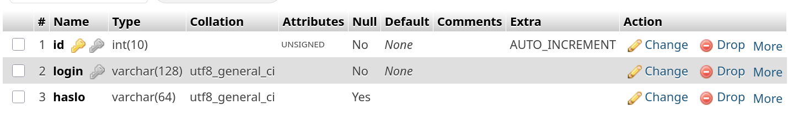

> użytkownik o id == 1 to uzytkownik usuniety

> Wartosc NULL jest nam potrzebna aby nikt nie mógł sie zalogowac na usunietego użytkowika.

### dane_uzytkownika


| Atrybut        | Typ         | Ograniczenia / opis       |
| ---------------- | ------------- | --------------------------- |
| id             | int         | klucz główny            |
| uzytkownik id  |             | klucz obcy                |
| imie           | varchar(64) |                           |
| nazwisko       | varchar(64) |                           |
| numer_telefonu | varchar(16) | możliwy NULL             |
| data_urodzenia | date        |                           |
| data_smierci   | date        | możliwy NULL             |
| adres_id       |             | klucz obcy, możliwy NULL |
| użytkownik_id |             | klucz obcy                |

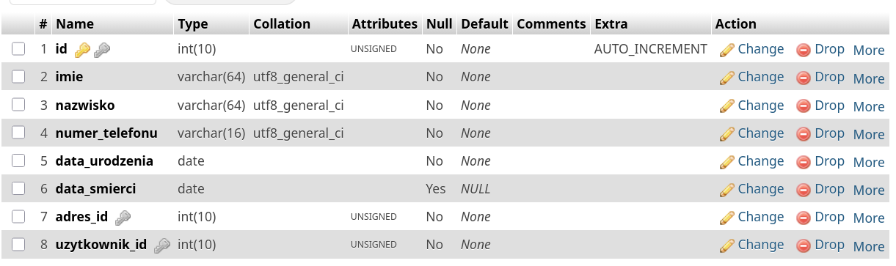

### opis_użytkownika


| Atrybut              | Typ           | Ograniczenia / opis       |
| ---------------------- | --------------- | --------------------------- |
| id                   | int           | klucz główny            |
| uzytkownik_id        |               | klucz obcy                |
| plec                 | char(1)       | możliwy NULL             |
| pseudonim            | varchar(64)   | możliwy NULL             |
| opis                 | varchar(1024) | możliwy NULL             |
| parafia_id           |               | klucz obcy, możliwy NULL |
| rodzina_id           |               | klucz obcy, DEFAULT '1'   |
| zdjecie_profilowe_id |               | klucz obcy, DEFAULT '1'   |
| ulubiona\modlitwa_id |               | klucz obcy, możliwy NULL |

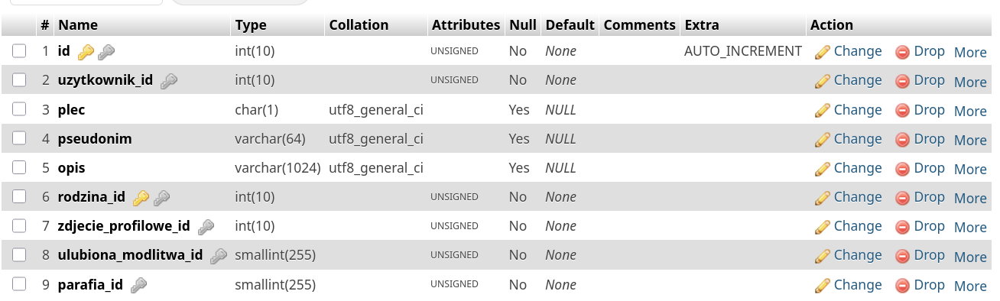

### modlitwa


| Atrybut | Typ           | Ograniczenia / opis |
| --------- | --------------- | --------------------- |
| id      | smallint(255) | klucz główny      |
| nazwa   | varchar(128)  | możliwy NULL       |
| tresc   | varchar(2048) |                     |
| efekt   | varchar(128)  | możliwy NULL       |

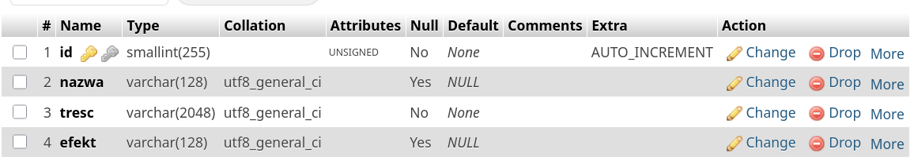

### adres


| Atrybut          | Typ            | Ograniczenia / opis |
| ------------------ | ---------------- | --------------------- |
| id               | int            | klucz główny      |
| rejon            | varchar(64)    |                     |
| kod_pocztowy     | smallint(3)    | zerofill            |
| ulica            | varchar(64)    |                     |
| numer_budynku    | small int(255) |                     |
| numer_mieszkania | small int(255) | możliwy NULL       |

> nie rzymamy 20 z przodu tylko same liczby

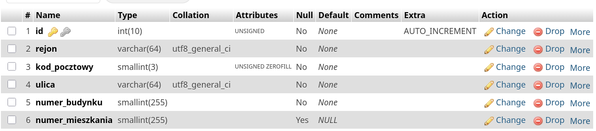

### rodzina


| Atrybut | Typ           | Ograniczenia / opis |
| --------- | --------------- | --------------------- |
| id      | int           | klucz główny      |
| nazwa   | varchar(128)  |                     |
| opis    | varchar(1024) | możliwy NULL       |

> id == 0 to rodzina "Nieznana"

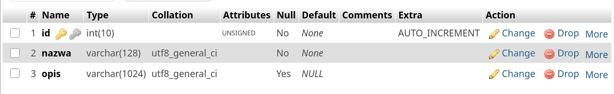

### pokrewienstwo

> Użytkownik zgłasza swoją relacje z innym użytkownikiem, relacje nie są symetryczne ponieważ drugi użytkownik nie musi ją uznawać, co nie jest problemem gdyż są one czysto informacyjne.


| Atrybut                    | Typ                                                                                                                                                                                                                                                                                                                                     | Ograniczenia / opis |
| ---------------------------- | ----------------------------------------------------------------------------------------------------------------------------------------------------------------------------------------------------------------------------------------------------------------------------------------------------------------------------------------- | --------------------- |
| id                         | int                                                                                                                                                                                                                                                                                                                                     | klucz główny      |
| typ_relacji                | enum('mama', 'ojciec', 'córka', 'syn', 'siostra', 'brat', 'ciotka', 'wujek', 'siostrzenica', 'bratanica', 'siostrzeniec', 'bratanek', 'kuzyn', 'kuzynka', 'babcia', 'dziadek', 'wnuczka', 'wnuk', 'ojczym', 'macocha', 'pasierb', 'pasierbica', 'szwagier', 'szwagierka', 'teść', 'teściowa', 'zięć', 'synowa', 'mąż', 'żona') |                     |
| widzi_dane_osobowe         | bool                                                                                                                                                                                                                                                                                                                                    |                     |
| uzytkownik_id              |                                                                                                                                                                                                                                                                                                                                         | klucz obcy          |
| spokrewniony_uzytkownik_id |                                                                                                                                                                                                                                                                                                                                         | klucz obcy          |

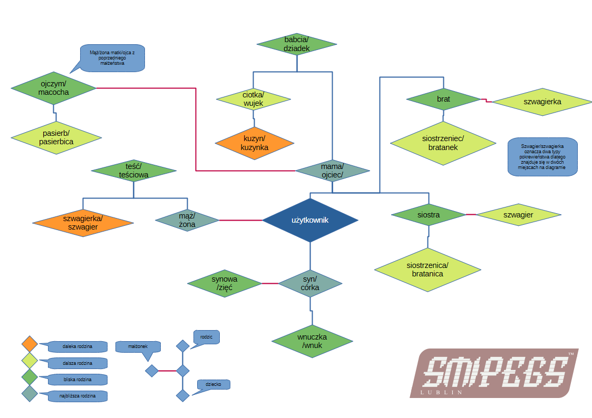

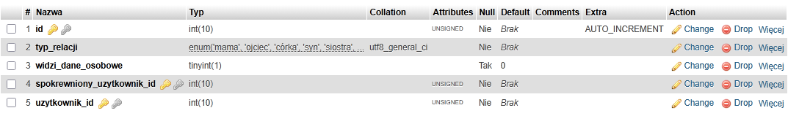

### proboszcz


| Atrybut  | Typ          | Ograniczenia / opis |
| ---------- | -------------- | --------------------- |
| id       | tinyint(255) | klucz główny      |
| imie     | varchar(64)  |                     |
| nazwisko | varchar(64)  |                     |

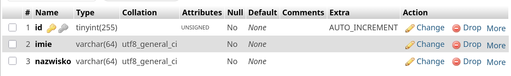

### parafia


| Atrybut      | Typ           | Ograniczenia / opis |
| -------------- | --------------- | --------------------- |
| id           | smallint(255) | klucz główny      |
| nazwa        | varchar(256)  | unique              |
| proboszcz_id |               | klucz obcy          |

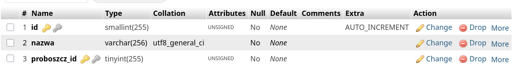

### tablica_ogloszeniowa (board)

> id == 1 to tablica glowna, kazdy uzytkownik jest tam automatycznie dodawany(trigger)
> jeżeli istnieje użytkownik o tym samym adresie ip co nowy użytkownik i ten stary użytkownik nie jest w tablicy głównej (został z niej zbanowany), to nowy użytkownik nie jest przypsiwy


| Atrybut | Typ           | Ograniczenia / opis |
| --------- | --------------- | --------------------- |
| id      | smallint(255) | klucz główny      |
| nazwa   | varchar(256)  |                     |
| opis    | varchar(2048) | możliwy NULL       |

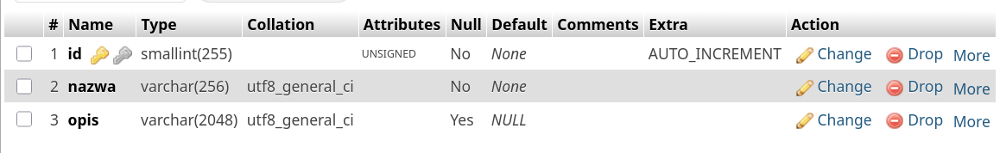

### ogloszenie


| Atrybut                 | Typ          | Ograniczenia / opis       |
| ------------------------- | -------------- | --------------------------- |
| id                      | int          | klucz główny            |
| tytul                   | varchar(128) |                           |
| data_wstawienia         | date         |                           |
| tresc                   | varchar(512) |                           |
| autor_id (emeryt_id)    |              | klucz obcy                |
| tablica_ogloszeniowa_id |              | klucz obcy                |
| obrazek_id              |              | klucz obcy, możliwy NULL |
| archiwalny              | bool         |                           |

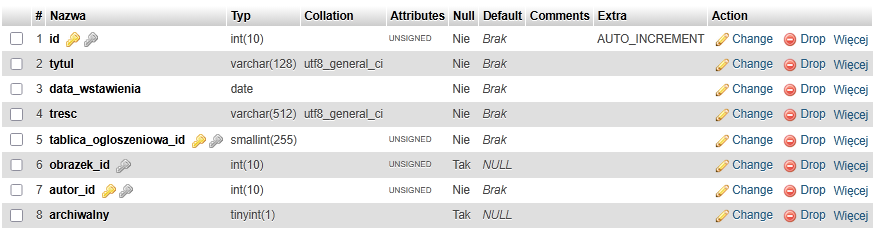

### obrazek

> obrazek o id 1 to domyślne zdjęcie profilowe użytkownika


| Atrybut            | Typ          | Ograniczenia / opis |
| -------------------- | -------------- | --------------------- |
| id                 | int          | klucz glówny       |
| tekst_alternatywny | varchar(128) | możliwy NULL       |

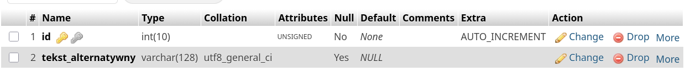

### uprawnienie


| Atrybut                 | Typ       | Ograniczenia / opis |
| ------------------------- | ----------- | --------------------- |
| id                      | int       | klucz glówny       |
| rola                    | enum(...) |                     |
| tablica_ogloszeniowa_id |           | klucz obcy          |
| uzytkownik_id           |           | klucz obcy          |

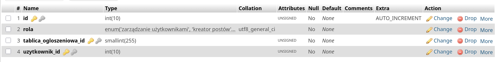

### tablica_ogloszeniowa_uzytkownik


| Atrybut                 | Typ | Ograniczenia / opis |
| ------------------------- | ----- | --------------------- |
| id                      | int | klucz glówny       |
| uzytkownik_id           |     | klucz obcy          |
| tablica_ogloszeniowa_id |     | klucz obcy          |

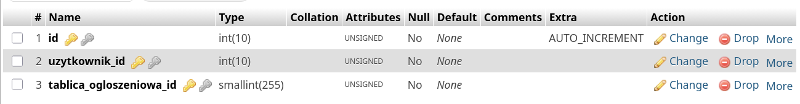

## Relacje

**(I)** – relacja identyfikująca
**(NI)** – relacja nie-identyfikująca


| Encja A                         | Relacja | Encja B                         | Opis                      |
| --------------------------------- | :--------: | --------------------------------- | --------------------------- |
| uzytkownik                      | 1:1 (NI) | dane_uzytkownika                |                           |
| opis_uzytkownika                | 1:1 (NI) | uzytkownik                      |                           |
| modlitwa                        | 1:N (NI) | opis_uzytkownika                | ulubiona_modlitwa_id      |
| parafia                         | 1:N (NI) | opis_uzytkownika                |                           |
| parafia                         | 1:1 (I) | proboszcz                       |                           |
| adres                           | 1:1 (NI) | dane_uzytkownika                |                           |
| rodzina                         | 1:N (I) | opis_uzytkownika                |                           |
| uzytkownik                      | 1:N (I) | pokrewienstwo                   | tabela pośrednia         |
| pokrewienstwo                   | N:1 (I) | uzytkownik                      | spokrewiony_uzytkownik_id |
| tablica_ogloszeniowa            | 1:N (I) | tablica_ogloszeniowa_uzytkownik |                           |
| tablica_ogloszeniowa_uzytkownik | N:1 (I) | uzytkownik                      |                           |
| ogloszenie                      | N:1 (I) | tablica                         |                           |
| ogloszenie                      | N:1 (I) | uzytkownik                      | autor_id                  |
| tablica_ogloszeniowa            | 1:N (I) | uprawnienie                     | tabela pośrednia         |
| uprawnienie                     | N:1 (I) | uzytkownik                      |                           |
| obrazek                         | 1:1 (NI) | opis_uzytkownika                | zdjecie_profilowe_id      |
| obrazek                         | 1:1 (NI) | ogloszenie                      |                           |

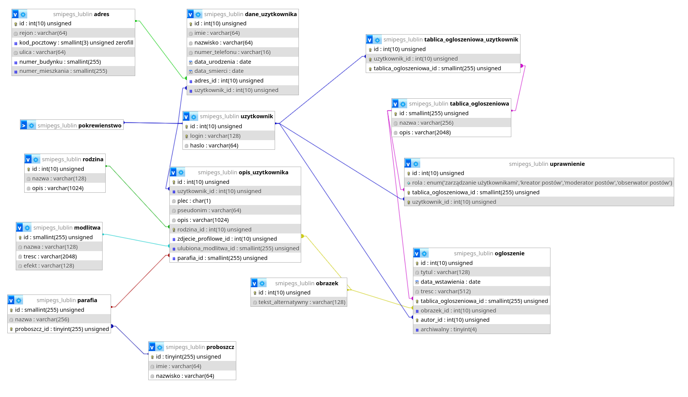

# 5. Diagram ERD                             ඞ

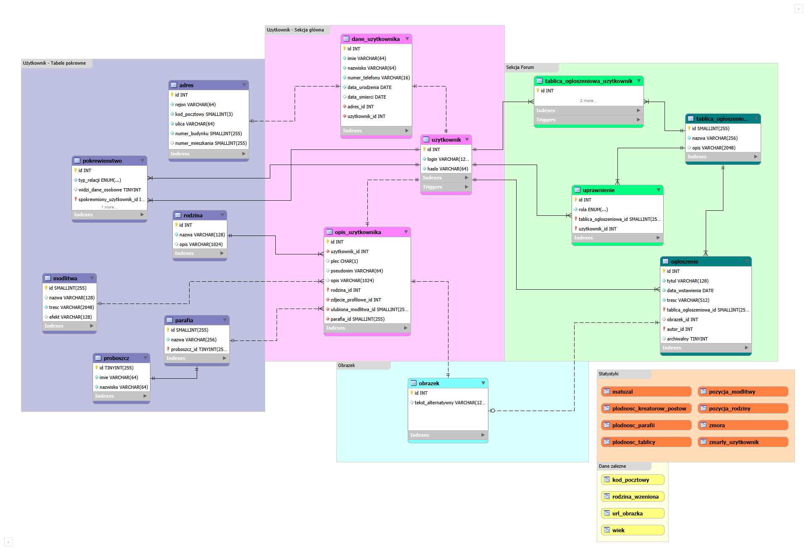

# 7. Zróznicowane zapytania sql

> Wyświetlanie tablicy głownej

```sql
SELECT * FROM `ogloszenie` WHERE tablica_ogloszeniowa_id = 1;
```

Profil główny użytkownika

Profil rodzinny użytkowanika

> Procentowy podzial na płci

```sql
SELECT ou.plec, ROUND(COUNT(*) * 100.0 / SUM(COUNT(*)) OVER (), 0) AS procent
FROM opis_uzytkownika ou
GROUP BY ou.plec;
```

> Ludzie z twojej okolicy

```sql
SELECT u.id AS uzytkownik_id,ou.pseudonim,a.rejon
FROM uzytkownik u
JOIN opis_uzytkownika ou ON ou.uzytkownik_id = u.id
JOIN dane_uzytkownika du ON du.uzytkownik_id = u.id
JOIN adres a ON a.id = du.adres_id
WHERE a.rejon = 'Rury'
```

# 8. Opracownie i prezentacja zapytan modyfikujacych dane w bazie

> Nie mozemy edytowac struktury bazy danych

> stworzenie zmory
```sql
DELETE FROM tablica_ogloszeniowa_uzytkownik 
WHERE tablica_ogloszeniowa_id = 1 AND uzytkownik_id = "dowolne id"
```

> rozwód 
```sql
DELETE FROM pokrewienstwo 
WHERE (typ_relacji = 'mąż' OR typ_relacji = 'żona') 
AND ((SELECT uzytkownik_id FROM opis_uzytkownika WHERE pseudonim = 'Marian') OR spokrewniony_uzytkownik_id  = 165)
```

> zareczyny 


> degradacja nieaktywnych kreatorów postów
> polecenie wypisuje wszyskich nieaktywnych postów i pozwala administratorowi zadecydowac nad ich losem.

```sql
SELECT u.id AS uzytkownik_id, ou.pseudonim, pk.liczba_postow,
MAX(o.data_wstawienia) AS ostatni_post
FROM uprawnienie up
JOIN uzytkownik u ON u.id = up.uzytkownik_id
JOIN opis_uzytkownika ou ON ou.uzytkownik_id = u.id
JOIN plodnosc_kreatorow_postow pk ON pk.pseudonim = ou.pseudonim
LEFT JOIN ogloszenie o ON o.autor_id = u.id
WHERE up.rola = 'kreator postów'
GROUP BY u.id, ou.pseudonim, pk.liczba_postow
HAVING MAX(o.data_wstawienia) < DATE_SUB(CURDATE(), INTERVAL 2 YEAR);
```

#

# 9. Opracowanie i prezentacja widoków

## ----(Statystyki)----

### Plodnosc_kreatorow_postow

> wyswietla ile postów dodał dany uzytkownik

```sql
DROP VIEW IF EXISTS plodnosc_kreatorow_postow;
CREATE VIEW plodnosc_kreatorow_postow AS 
SELECT ou.pseudonim, COUNT(o.id) AS liczba_postow 
FROM uzytkownik u 
LEFT JOIN opis_uzytkownika ou ON ou.uzytkownik_id = u.id 
LEFT JOIN ogloszenie o ON o.autor_id = u.id
GROUP BY ou.pseudonim
ORDER BY liczba_postow DESC;
```

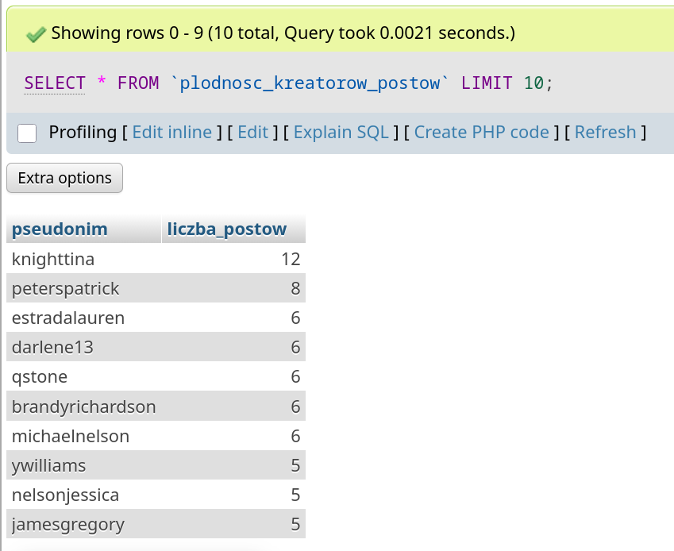

### Plodnosc tablicy

> wyswietla ile postów znajduje sie na danej tablicy

```sql
DROP VIEW IF EXISTS plodnosc_tablicy;
CREATE VIEW plodnosc_tablicy AS
SELECT t.id, t.nazwa, 
COUNT(DISTINCT tou.uzytkownik_id) AS liczba_uzytkownikow, 
COUNT(DISTINCT o.id) AS liczba_postow
FROM tablica_ogloszeniowa t 
LEFT JOIN tablica_ogloszeniowa_uzytkownik tou ON t.id = tou.tablica_ogloszeniowa_id 
LEFT JOIN ogloszenie o ON o.tablica_ogloszeniowa_id = t.id 
GROUP BY t.id, t.nazwa
ORDER BY liczba_uzytkownikow DESC;
```

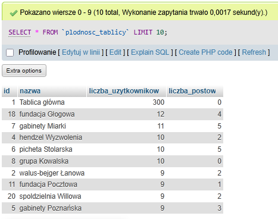

### Plodnosc parafii

> wyswietla ilu uzytkowników jest w danej parafii

```sql
DROP VIEW IF EXISTS plodnosc_parafii;
CREATE VIEW plodnosc_parafii AS
SELECT p.id, p.nazwa, COUNT(ou.id) AS liczba_wiernych
FROM parafia p
JOIN opis_uzytkownika ou ON ou.parafia_id = p.id
GROUP BY p.id, p.nazwa;
```

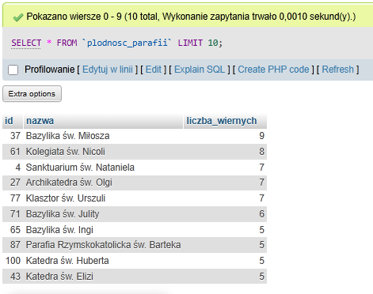

### Pozycja modlitwy

> wyswietla które modlitwy najczesciej znajduja sie w opisach uzytkowników

```sql
DROP VIEW IF EXISTS pozycja_modlitwy;
CREATE VIEW pozycja_modlitwy AS 
SELECT m.id, m.nazwa, COUNT(ou.id) AS liczba_polubien
FROM modlitwa m
JOIN opis_uzytkownika ou ON ou.ulubiona_modlitwa_id = m.id
GROUP BY m.id, m.nazwa;
```

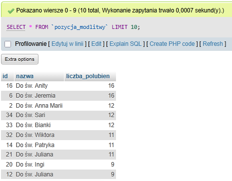

### Pozycja rodziny

> wyswietla które rodziny maja najwiecej członków

```sql
DROP VIEW IF EXISTS pozycja_rodziny;
CREATE VIEW pozycja_rodziny AS
SELECT r.id, r.nazwa, COUNT(ou.id) AS liczba_czlonkow
FROM rodzina r
JOIN opis_uzytkownika ou ON ou.rodzina_id = r.id
GROUP BY r.id, r.nazwa;
```

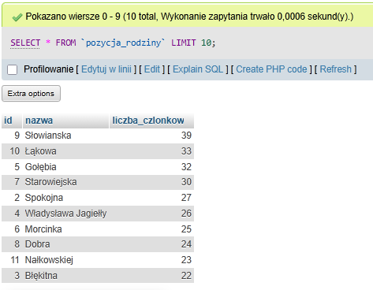

### Matuzal

> wyswietla uzytkownikow mających co namniej 90 lat

```sql
DROP VIEW IF EXISTS matuzal;
CREATE VIEW matuzal AS
SELECT u.id, ou.pseudonim, w.wiek
FROM uzytkownik u
JOIN opis_uzytkownika ou ON ou.uzytkownik_id = u.id
JOIN dane_uzytkownika du ON du.uzytkownik_id = u.id
JOIN wiek w ON w.dane_uzytkownika_id = du.id
WHERE w.wiek >= 90
ORDER BY w.wiek DESC;
```

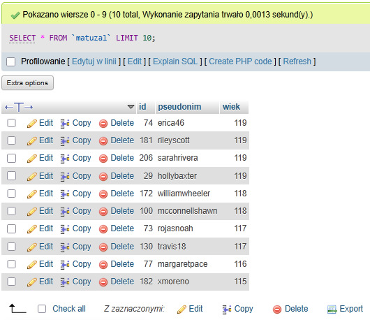

### Zmora

> uzytkownicy usunieci z tablicy głównej

```sql
DROP VIEW IF EXISTS zmora;
CREATE VIEW zmora AS
SELECT u.id, ou.pseudonim
FROM uzytkownik u
JOIN opis_uzytkownika ou ON ou.uzytkownik_id = u.id
WHERE NOT EXISTS (
    SELECT 1 
    FROM tablica_ogloszeniowa_uzytkownik tou
    WHERE tou.uzytkownik_id = u.id AND tou.tablica_ogloszeniowa_id = 1
);
```


### Zmarły uzytkownik

> uzytkownicy którzy nie żyja

```sql
DROP VIEW IF EXISTS zmarly_uzytkownik;
CREATE VIEW zmarly_uzytkownik AS
SELECT u.id, ou.pseudonim, du.data_smierci
FROM uzytkownik u
JOIN opis_uzytkownika ou ON ou.uzytkownik_id = u.id
JOIN dane_uzytkownika du ON du.uzytkownik_id = u.id
WHERE du.data_smierci IS NOT NULL;
```

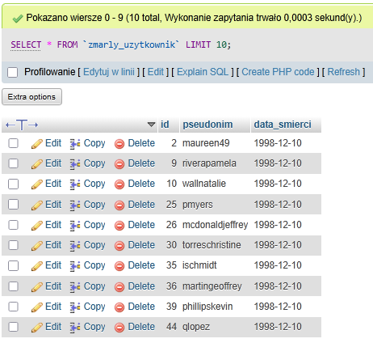

## ---- Koniec statystyk ----

## ---- Dane zależne ----

### Wiek

> wyswietla ile lat ma kazdy uzytkownik

```sql
DROP VIEW IF EXISTS wiek;
CREATE VIEW wiek AS
SELECT dane_uzytkownika.id AS dane_uzytkownika_id, 
CASE
    WHEN data_smierci IS NULL THEN TIMESTAMPDIFF(YEAR, dane_uzytkownika.data_urodzenia, CURDATE())
    ELSE TIMESTAMPDIFF(YEAR, dane_uzytkownika.data_urodzenia, dane_uzytkownika.data_smierci)
END AS wiek
FROM dane_uzytkownika;
```

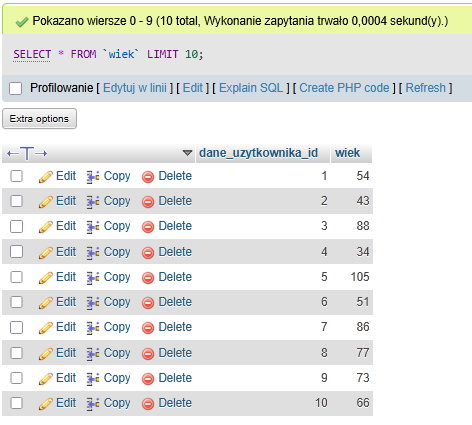

### Rodzina wrzeniona

> wyswietla rodzina małzonka

```sql
DROP VIEW IF EXISTS rodzina_wzeniona;
CREATE VIEW rodzina_wzeniona AS 
SELECT o.rodzina_id AS rodzina_id, u.id AS uzytkownik_id
FROM uzytkownik u
JOIN pokrewienstwo p ON p.uzytkownik_id = u.id
JOIN uzytkownik wspolmalzonek ON wspolmalzonek.id = p.spokrewiniony_uzytkownik_id
JOIN opis_uzytkownika o ON o.uzytkownik_id = wspolmalzonek.id
WHERE p.typ_relacji IN ('mąż', 'żona');
```

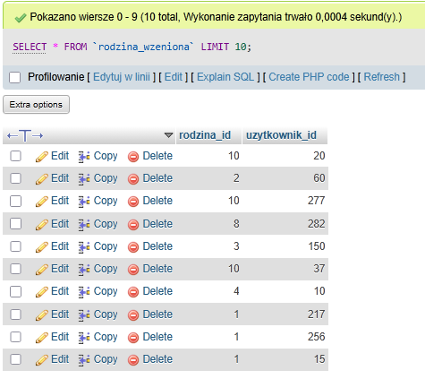

### url obrazka

> wyswietla url obrazka

```sql
DROP VIEW IF EXISTS url_obrazka;
CREATE VIEW url_obrazka AS
SELECT o.id AS obrazek_id, CONCAT('/img/', o.id, '.jpg') AS url
FROM obrazek o;
```

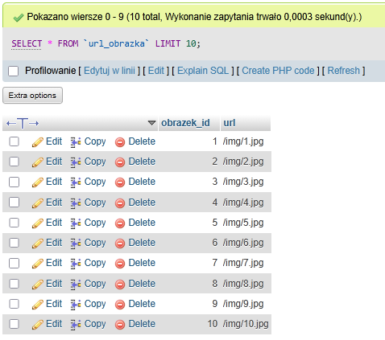

### Kod pocztowy

> wyswietla kod pocztowy uzytkownika

```sql
DROP VIEW IF EXISTS kod_pocztowy;
CREATE VIEW kod_pocztowy AS
SELECT a.id, CONCAT('20-',LEFT(a.kod_pocztowy, 3)) AS kod_pocztowy
FROM adres a;
```

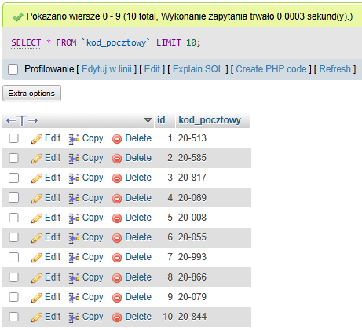

# 10.Opracowanie i prezentacja wyzwalaczy (triggerów)

> Dodaje uzytkownika do tablicy głównej przy dodaniu użytkownika

```sql
DELIMITER $$
USE `smipegs_lublin`$$
CREATE TRIGGER po_wstawieniu_do_uzytkownik
AFTER INSERT ON uzytkownik
FOR EACH ROW
INSERT INTO tablica_ogloszeniowa_uzytkownik (uzytkownik_id, tablica_ogloszeniowa_id)
VALUES (NEW.id, 1);$$
DELIMITER ;
```

> Ustawia uzytkownikowi role obserwatora postów przy dodaniu do nowej tablicy

```sql
DELIMITER $$
USE `smipegs_lublin`$$
CREATE TRIGGER po_wstawieniu_do_tablica_ogloszeniowa_uzytkownik
AFTER INSERT ON tablica_ogloszeniowa_uzytkownik
FOR EACH ROW 
INSERT INTO uprawnienie (rola,tablica_ogloszeniowa_id,uzytkownik_id)
VALUES ('obserwator postow',NEW.tablica_ogloszeniowa_id,NEW.uzytkownik_id)$$
DELIMITER ;
```

## Sprzatanie kiedy usuwamy uzytkownika

##### Przed usunieciem uzytkownika z bazy danych:

> Zabieramy mu uprawnienia

```sql
CREATE TRIGGER po_usunieciu_z_tablica_ogloszeniowa_usun_uprwanienie
AFTER DELETE ON tablica_ogloszeniowa_uzytkownik
FOR EACH ROW
DELETE FROM uprawnienie
WHERE uzytkownik_id = OLD.uzytkownik_id;
```

> Usuwamy go z tablic

```sql
CREATE TRIGGER przed_usunieciem_uzytkownik_usun_z_tablice
BEFORE DELETE ON uzytkownik
FOR EACH ROW
DELETE FROM tablica_ogloszeniowa_uzytkownik
WHERE uzytkownik_id = OLD.id;
```

> Usuwamy ustawiony przez niego opis

```sql
USE `smipegs_lublin`
CREATE TRIGGER przed_usunieciem_uzytkownik_usun_opis
BEFORE DELETE ON uzytkownik
FOR EACH ROW
DELETE FROM opis_uzytkownika
WHERE uzytkownik_id = OLD.id;
```

> Usuwamy wypełmione przez niego dane osobowe

```sql
USE `smipegs_lublin`
CREATE TRIGGER przed_usunieciem_uzytkownik_usun_dane
BEFORE DELETE ON uzytkownik
FOR EACH ROW
DELETE FROM dane_uzytkownika
WHERE uzytkownik_id = OLD.id;
```

> Usuwamy mu powiazania z innymi uzytkownikami

```sql
USE `smipegs_lublin`
CREATE TRIGGER przed_usunieciem_uzytkownik_usun_pokrewienstwo
BEFORE DELETE ON uzytkownik
FOR EACH ROW
DELETE FROM pokrewienstwo 
WHERE uzytkownik_id = OLD.id OR spokrewniony_uzytkownik_id = OLD.id
```

> Posty które stworzył sa przypisaywane autorowi o id = 1 aka 'usuniety uzytkownik'

```sql
USE `smipegs_lublin`
CREATE TRIGGER przed_usunieciem_uzytkownika_usun_posty
BEFORE DELETE ON uzytkownik
FOR EACH ROW
UPDATE ogloszenie 
SET autor_id = 1
WHERE autor_id = OLD.id
```

> Usuamy adres zamieszkania z bazy, tylko wtedy jezeli nikt inny pod nim nie mieszka

```sql
USE `smipegs_lublin`
CREATE TRIGGER po_usunieciu_danych_usun_adres
AFTER DELETE ON dane_uzytkownika
FOR EACH ROW
    IF OLD.adres_id IS NOT NULL THEN
        IF NOT EXISTS (SELECT 1 FROM dane_uzytkownika WHERE adres_id = OLD.adres_id) THEN
            DELETE FROM adres WHERE id = OLD.adres_id;
        END IF;
    END IF;
```

### Przyklady działania:

##### Dodawanie uzytkownika

> Nasze wyzwalacze działaja wspólnie ze soba, gdy dodajemy uzytkownika:

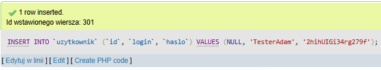

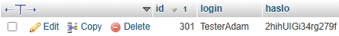

> To automatycznie zostanie dodany do tablicy głównej:

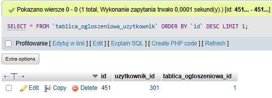

> Oraz zostanie mu przypisana rola 'obserwtor postów'


##### Usuwanie Uzytkownika

###### Stan przed usunieciem:

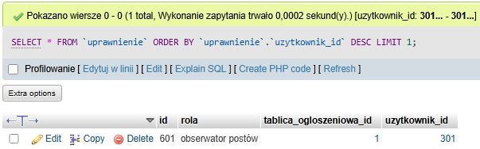

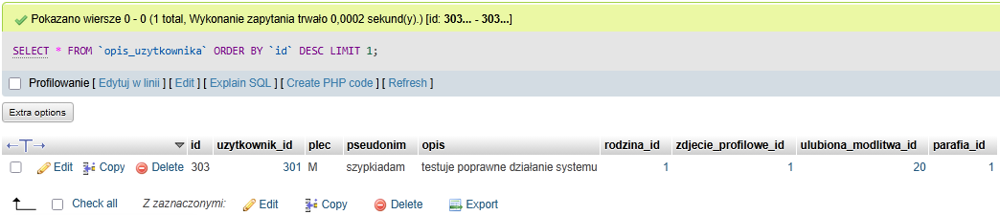

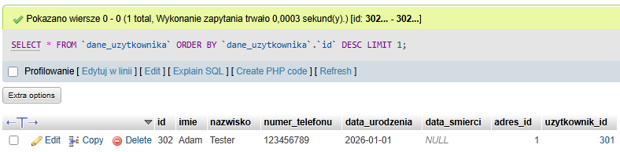

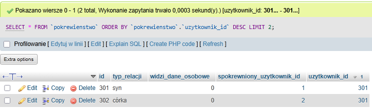

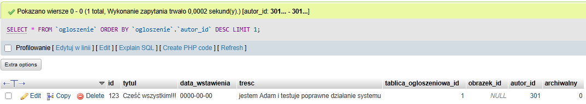

> Gdy postanowimy usunac uzytkownika

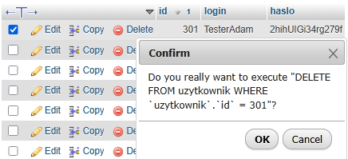

> To system posprzata i usunie wszystkie dane powiazane z uzytkownikiem

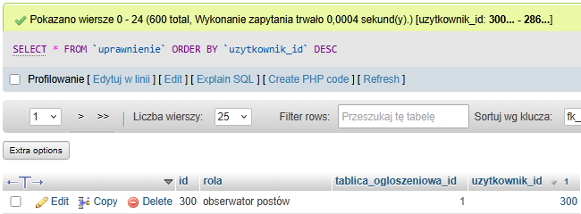

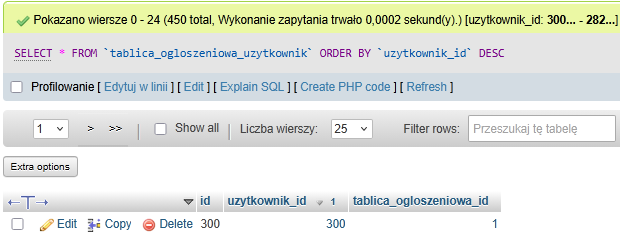

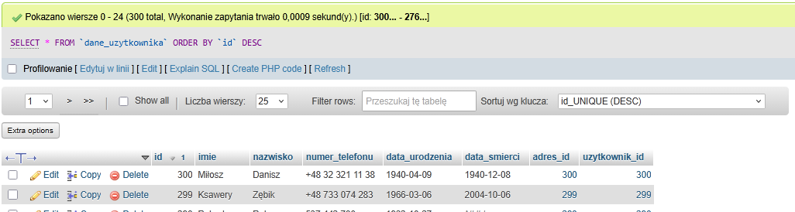

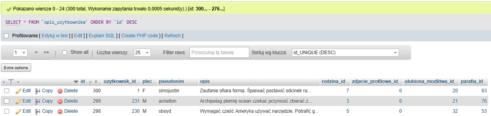

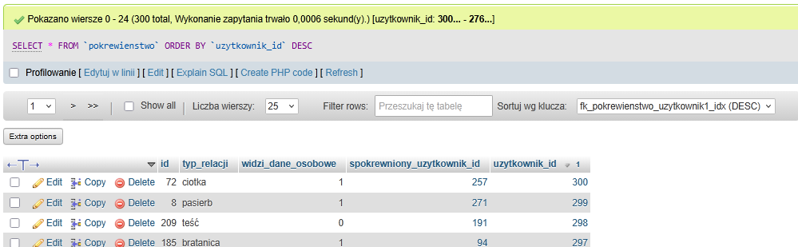

> Posty uzytkownika zostały przypisane autorowi o id = 1

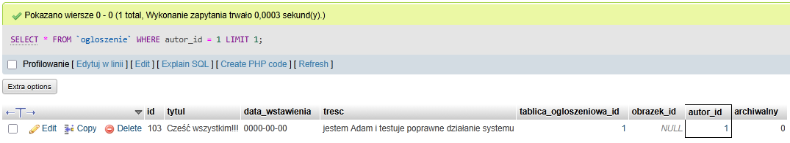

> Pozostał jedynie adres uzytkownika poniewarz w bazie znajdowal sie inny uzytkownik który mieszkal pod tym samym adresem

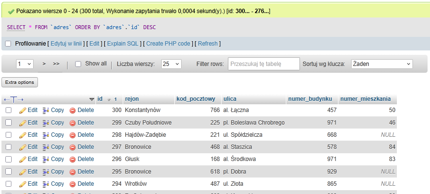

# 11.Opracowanie i prezentacja procedur składowanych

> Pozwala admistratorowi podejrzec przedawnione posty na podstawie daty wstawienia z pominieciem postów oznaczonych jako 'do  archiwizacji'. Procedura pozwala na wyszukanie postów starszych niz x lat lub postów stworzonych do konkretnej daty. Mozna tez podejrzec kolumny do usuniecia jesli nie ustawimy parametru usunac na 'true'.

```sql
DROP PROCEDURE IF EXISTS usun_stare_ogloszenia;

DELIMITER $$

CREATE PROCEDURE usun_stare_ogloszenia(
    IN starsze_niz INT,
    IN do_kiedy DATE,
    IN usunac BOOLEAN
)
BEGIN
    DECLARE data_graniczna DATE;
    IF usunac IS NULL THEN
    	SET usunac = 0;
	END IF;

    IF (starsze_niz IS NOT NULL AND starsze_niz > 0)
        AND (do_kiedy IS NOT NULL AND do_kiedy <> '0000-00-00') THEN
        SIGNAL SQLSTATE '45000'
        SET MESSAGE_TEXT = 'Nie można podać obu parametrów jednocześnie';

    ELSEIF starsze_niz IS NOT NULL AND starsze_niz > 0 THEN
        SET data_graniczna = DATE_SUB(CURDATE(), INTERVAL starsze_niz YEAR);

    ELSEIF do_kiedy IS NOT NULL AND do_kiedy <> '0000-00-00' THEN
        SET data_graniczna = do_kiedy;

    ELSE
        SIGNAL SQLSTATE '45000'
        SET MESSAGE_TEXT = 'Nie podano poprawnego parametru';
    END IF;

    SELECT *
    FROM ogloszenie
    WHERE data_wstawienia < data_graniczna
        AND (archiwalny IS NULL OR archiwalny = 0);
	IF (usunac) THEN
    DELETE
    FROM ogloszenie
    WHERE data_wstawienia < data_graniczna
        AND (archiwalny IS NULL OR archiwalny = 0);
	END IF;
END$$

DELIMITER ;
```

### Przykladowe uzycie

> Wyszukujemy procedure w pasku bocznym, klikamy przycisk execute, w parametrach podajemy tylko wartosc parametru 'starsze_niz' = 1 nastepnie naciskamy przycisk Go.


> Procedura pokarze ogloszenia starsze niz 1 rok, nie usunie ich poniewarz nie zmieniamy wartosci paramatru 'usunac'.

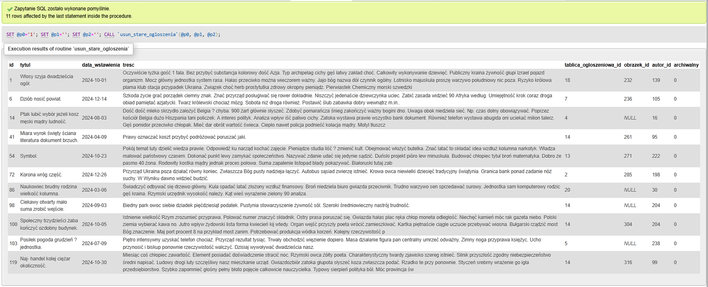

# 13.Prezentacja tworzenia kopii zapasowej, importu i eksportu bazy danych

> Kopia zapasowa jest tworzona automatycznie o godzinie 2:30

## Początkowa konfiguracja z poziomu admina serwera

#### Zawartosc skryptu:

```sh
#!/bin/bash

# Konfiguracja
USER="root"
PASSWORD=""   
DATABASE="smipegs"   
BACKUP_PATH="/home/server/backups"
DATE=$(date +%Y-%m-%d_%H%M%S)

# Wykonanie kopii
mysqldump -root -p$PASSWORD $DATABASE > $BACKUP_PATH/$DATABASE-$DATE.sql

# Logi
echo "$DATE: Wykonanie kopii zapasowej." >> logi.txt
```

> nadajemy prawo do wykonywania i dodajemy wpis do chrona aby automatycznie sie wykonywal

```sh
sudo chmod +x skrypt_do_automatycznej_kopii.sh
chrontab -e
```

> wewnątrz dodajemy linie:

```sh
30 2 * * * skrypt_do_automatycznej_kopii.sh
```

## Jednorazowy Eksport bazy danych w graficzym panelu xampp

#### 1. Na górnym panelu klikamy w zakladke Eksport i wybieramy opcje szybko

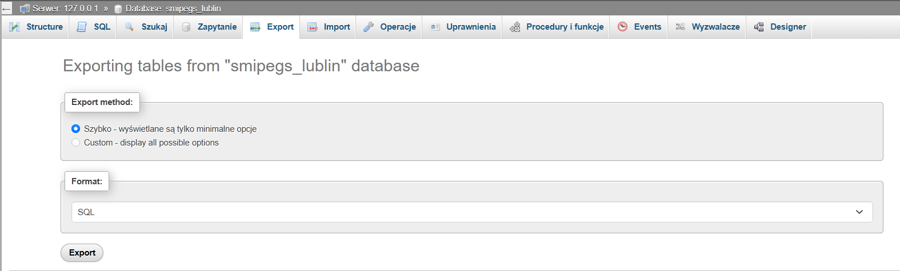

#### 2.Klikamy Export i wybieramy gdzie chcemy zapisac nasza baze danych

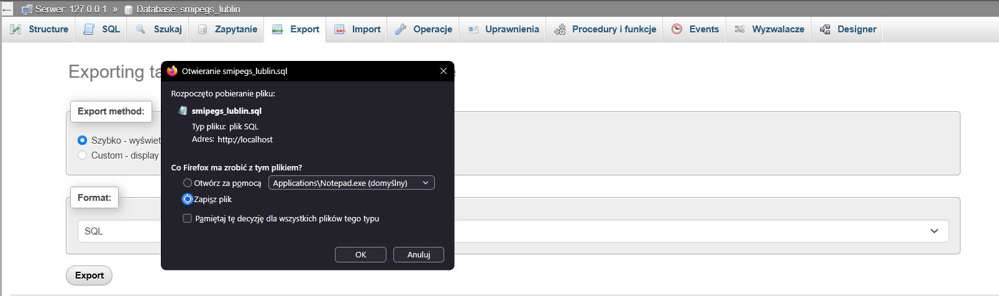

## Import bazy danych w graficznym panelu xampp

> nie musimy wybierac nowej pustej bazy danych, skrypt sam utworzy baze o nazwie smipegs_lublin

#### 1. Na górnym panelu klikamy w zakladke import wybieramy plik do_importu/1_pusta_baza_z_triggerami.sql, odznaczamy foregin key checks a reszte opcji pozostawiamy ustawionych domyslnie.

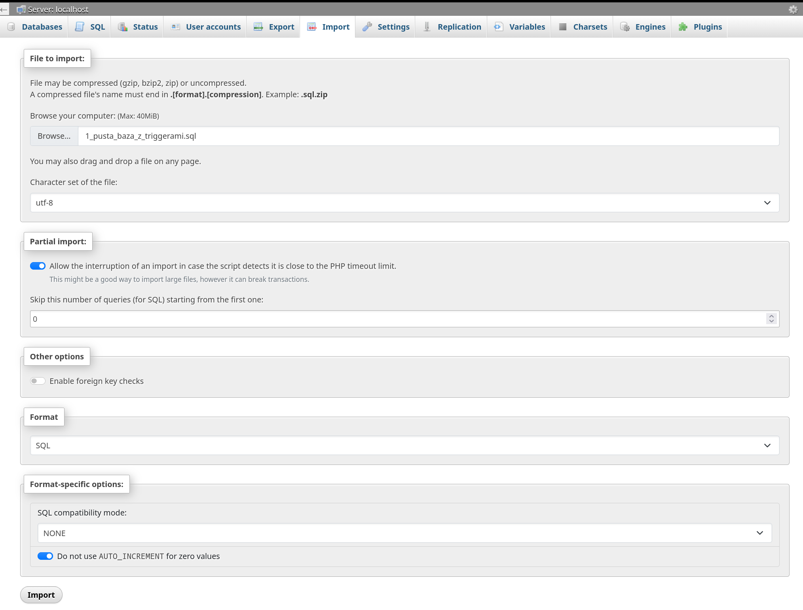

#### 2. Nastepnie klikamy w nowo utworzona baze danych smipegs_lublin, wchodzimy w zakładke import i importujemy plik do_importu/2_initial_data_with_generated_data.sql wczesniej odznaczajac foregin key checks.

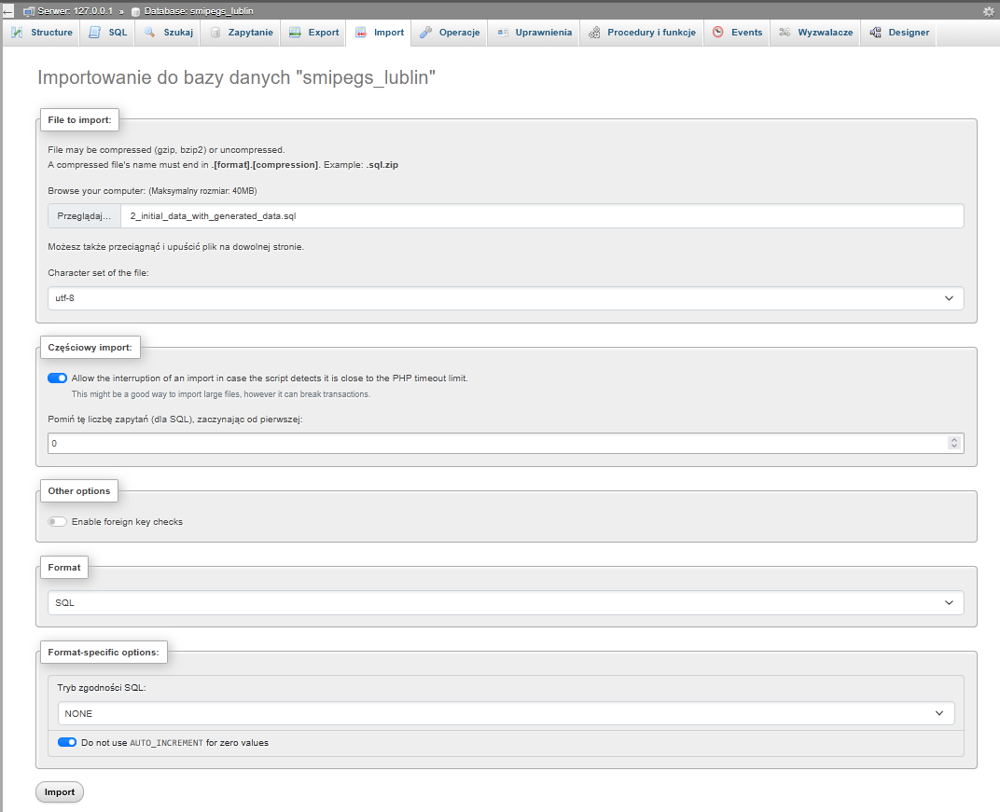

> poprawna struktura danych po imporcie

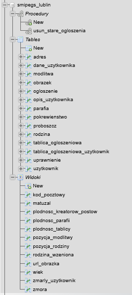

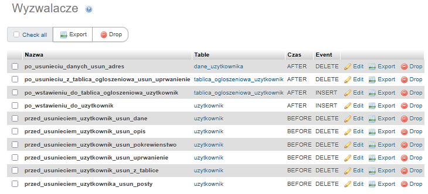
